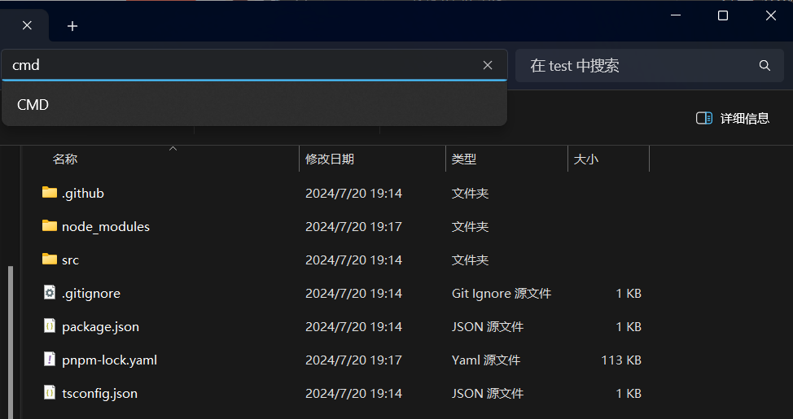
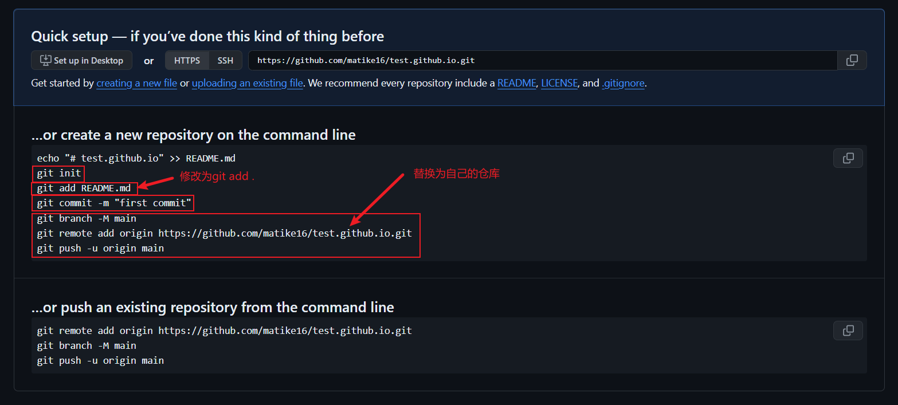
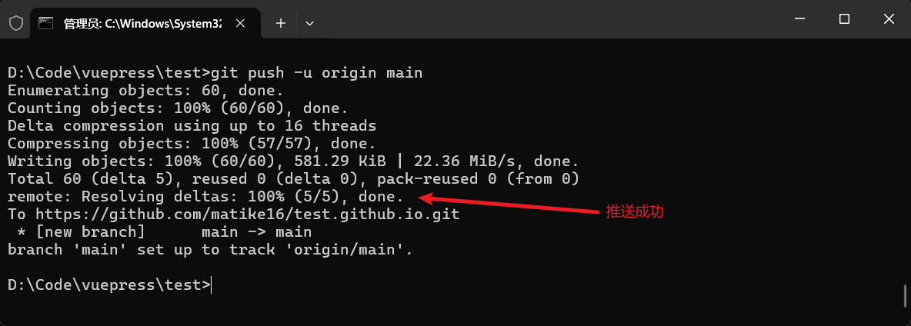
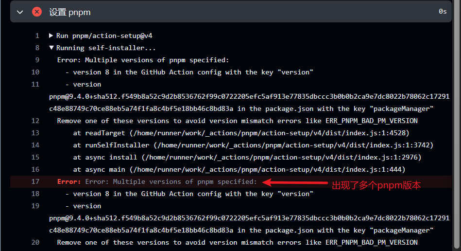
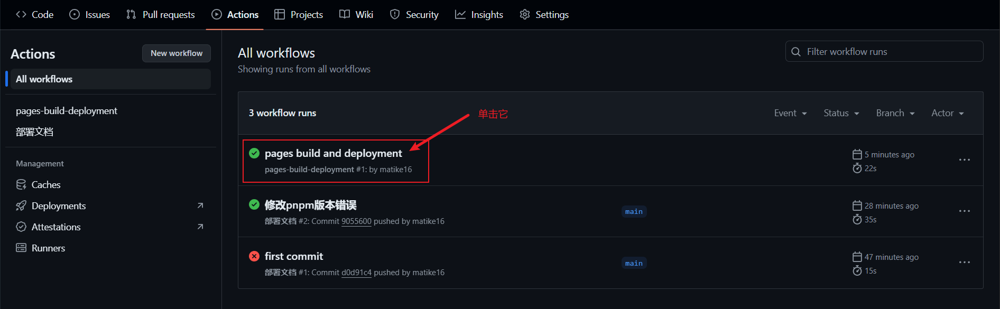

> [!note]
> 本篇文章将讲解如何将项目部署到Github Pages中，以实现博客的访问。对于样式以及配置的修改和二次开发将在稍后的文章中提及。

## 什么是Github Pages？

> [!tip] 
> GitHub Pages 是一个免费的静态网站托管服务，它允许用户直接从 GitHub 仓库托管静态网站。

### 特点

- ==免费==托管
- 只支持==静态==内容
- 可自定义域名
- 优秀的版本控制
- ==自动化==部署
- 预设主题与模板
- 良好的访问速度（国内易受审查和DNS域名污染影响，推荐使用代理或加速器访问）
- 基本的安全防护
- 优秀的社区支持

### 应用场景

- 个人或者组织的博客
- 项目文档和手册
- 作品集或者简历
- 小型网站或者着陆页

::: tip 为什么不使用Gitee Pages?
- 至本篇文章截稿，Gitee Pages服务仍在暂停中。
- Gitee有着严格的审查制度，部分文章无法通过。
> 但是Gitee Pages大大提高了国内的可访问性

:::

## 部署

> 接下来让我们部署项目到Github Pages
> 中吧！

### 1. 新建仓库

- 在Github个人首页点击右上角+号选择==New repository==


- 给仓库添加名称与描述
> [!important]
> 注意名称必须以.github.io结尾，这样Github就会将你的仓库部署到`https://username.github.io`这个子域名上，其中username是你的Github用户名。这个命名方式是必须的。


- 仓库类型默认公共(Public)即可


### 2. 配置工作流权限

> [!important]
> 在[快速入门](./快速入门)中我们已经确认选择了部署到Github Pages工作流，所以项目会自动为我们在.github/workflows文件夹中创建一个名为`deploy-docs`的yml文件，如果没有此文件请手动创建。

- 在项目仓库中依次打开Setting -> Actions -> General：


- 下拉在Workflow permissions中修改权限为"Read and write permissions"：


> [!tip]
> 在 GitHub Actions 中，"Workflow permissions"（工作流权限）是指定义工作流在运行时对仓库资源的访问权限。这些权限可以控制工作流能够读取或修改仓库中的哪些数据。以下是对不同权限的解释：

1. **Read and write permissions**（读写权限）:
    
    - 选择此选项时，工作流将获得对仓库所有范围的读写权限。这意味着工作流可以读取仓库中的所有内容，并且可以执行写操作，比如修改文件、创建或编辑 issue、合并 pull request 等。
2. **Read repository contents and packages permissions**（读取仓库内容和包权限）:
    
    - 如果选择这个选项，工作流只有读取仓库内容和包的权限。这意味着工作流可以读取仓库中的文件和包，但不允许执行写操作，比如不能推送代码、创建或合并 pull request。
3. **Allow GitHub Actions to create and approve pull requests**（允许 GitHub Actions 创建和批准 pull requests）:
    
    - 这个选项允许工作流创建 pull request，并且可以提交批准（approve）pull request 的 review。这通常用于自动化测试和持续集成流程，其中代码提交后，自动化脚本可以运行测试，如果测试通过，则自动批准 pull request。

> [!important]
> 在设置工作流权限时，始终建议遵循最小权限原则，即只为工作流提供完成其任务所必需的权限，以减少潜在的安全风险。

### 3. 修改base

> [!important]
> base如果配置不正确会导致css样式丢失

- 接着我们来到本地项目文件夹，依次点击：
- src -> .vuepress -> config.ts
- 使用编辑器VSCode打开config.ts，修改base为你在Github中创建的仓库名称：`/test.github.io/`


### 4. 推送项目到Github仓库

- 接着在文件资源管理器中打开我们的项目文件夹，在地址栏输入cmd并回车：



- 依次在终端中输入以下命令：

```cmd
# 如果运行过此命令，就不需要重复执行
git init

# 注意add之后有一个空格 . 代表全部
git add .

# 添加提交信息
git commit -m "first commit"

git branch -M main

# 注意修改为自己的仓库
git remote add origin https://github.com/matike16/test.github.io.git

# 推送
git push -u origin main
```

- 以上命令在Github创建仓库的Code首页均有提供：



- 推送成功



- 此时刷新Github仓库地址就可以看到项目代码了。

### 5. 查看Action并处理报错

- 接着我们点击项目导航栏中的Action，查看项目的部署情况：
	- 如果在 commit 前面显示绿色对勾则代表成功！

> [!warning]
> 此处可能存在以下报错：
> 
> 
> 
> - 此时我们打开本地文件资源管理器，找到项目中的./github/workflows文件夹中的`deploy-docs`文件打开，删除以下内容：
> 
> 
> 
> - 回到终端再依次运行以下命令：
> ```cmd
> git add .
> git commit -m "修改pnpm版本错误"
> git push -u origin main
> ```
> - 此时重新回到Github查看，选择Actions：
> 
> 
> 


### 6. 部署Pages

- 接着在Github项目仓库中依次点击：
- Settings -> Pages -> 选择gh-pages -> 点击Save


- 最后再次点击导航栏的Actions，会发现多了一个条目`pages-build-deployment`，单击它



- 最后点击网址查看，此时你的项目博客就已经成功部署到了Github Pages中了，你可以随时随地访问了。


