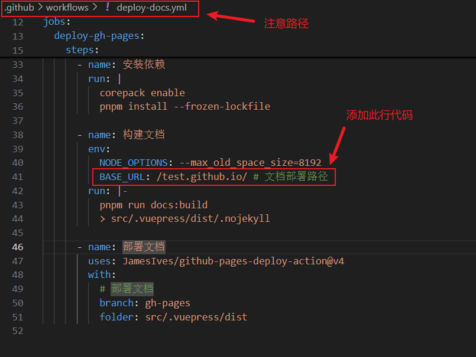
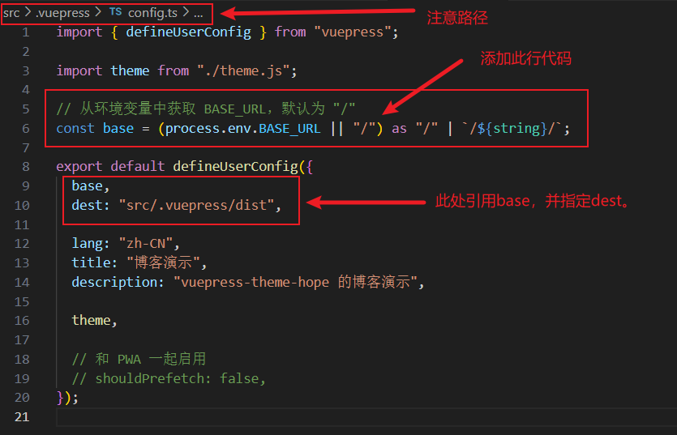
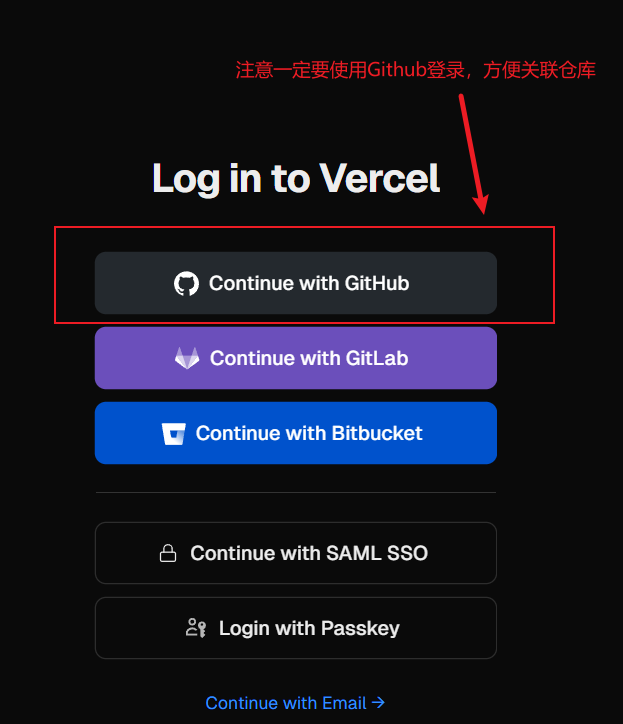
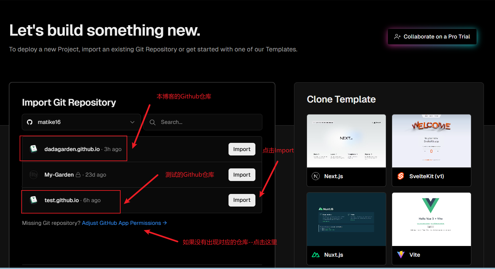
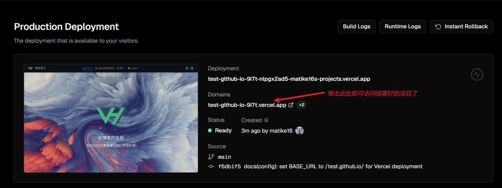
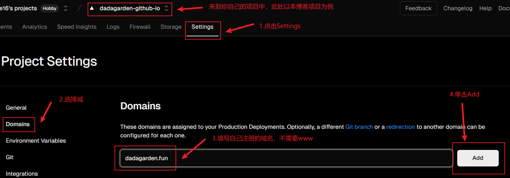
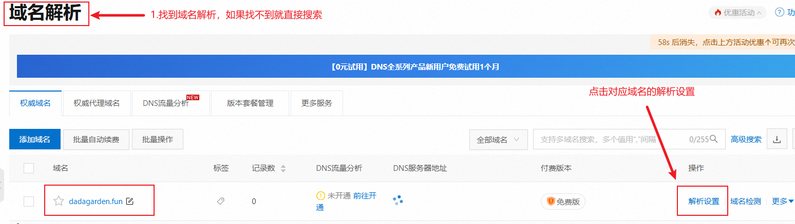
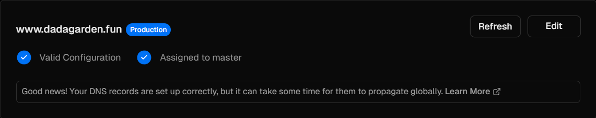

> [!note]
> 本篇文章将讲解如何将项目部署到Vercel中，并重定向地址到阿里云购买的域名。以实现在国内的正常访问。

## 前提

> [!important]
> - 配置Vercel之前，请确保你已经购买好了域名，域名可以在许多平台上购买到，此处以阿里云平台为例。
> - 同时确保你有使用代理的能力，避免无法访问Vercel。

## 什么是Vercel？

>[!tip]
>Vercel 是一个前端开发平台，专注于提供快速的全栈 Web 应用部署和==静态网站托管服务==。它由 Next.js 框架的创建团队开发，并且非常适合与 Next.js 配合使用。

### 特点

1. **自动化部署**：每当代码推送到 Git 仓库（例如 GitHub、GitLab 或 Bitbucket）时，Vercel 会自动进行构建和部署。
2. **全球 CDN**：Vercel 通过其全球内容分发网络（CDN）提供快速的页面加载速度，确保用户无论身处何地都能快速访问网站。（==国内依然会受到DNS污染的影响而导致无法访问==）
3. **服务器端渲染（SSR）和静态生成（SSG）**：Vercel 支持 Next.js 的服务器端渲染和静态生成功能，可以生成 SEO 友好的内容和更快的初始加载时间。
4. **自动化缩放**：根据流量情况，Vercel 会自动扩展应用，确保网站始终能快速响应。
5. **集成**：与多种工具和服务集成，如分析、日志记录、身份验证等，增强应用的功能。

	通过Vercel部署我们可以节省一笔不小的服务器费用，主要开支就只有域名购买了！
	接下来就开始我们的配置流程吧！

## 配置本地项目

### 设置环境变量BASE_URL

> [!important]
> 根据Github Pages中的部署规则我们知道，只有配置好了`base`才能正常加载页面样式，但是我们的base已经设置为Github中的仓库地址了，要实现在Github Pages和Vercel中部署的网页都正常显示样式，我们还需要对base进行修改。

- 首先通过VSCode打开本地项目
- 找到`.github/workflows/`文件夹下的`deploy-docs.yml`文件，并打开。
- 定位到`name: 构建文档`下的`env:`处
- 添加新的一行代码

```yml
BASE_URL: /test.github.io/ #其中test为你创建的仓库名称
```



- 接着来到`src /vuepress/`文件夹下
- 打开`config.ts`
- 定义并修改`base`，添加`dest`
- 对应代码如下：

```ts
// 定义base
const base = (process.env.BASE_URL || "/") as "/" | `/${string}/`;

// 引用base并添加dest
base,
dest: "src/.vuepress/dist"
```

> [!important]
> 因为 TypeScript 对 `base` 属性的类型进行了严格限制。它期望 `base` 是一个以斜杠开头和结尾的字符串，并且不接受动态的字符串类型。所以定义`base`处的代码要使用类型断言。



> [!tip]
> - `base` 配置影响生成的 HTML 文件中的资源路径。
> - `dest` 配置影响生成的文件目录，但不影响 CSS 样式的加载。

> [!warning]
> 假设你还在config.ts中定义了`head`，那么`head`对应的`href`也要修改。
> - `head`就是网页显示时导航栏的图标
> - 添加`head`代码如下：
> ```ts
> // 动态设置 favicon 的路径
>const faviconPath = `${base}favicon.ico`;
>// 修改 head
>head: [
>	[
>		"link",
>		{
>			rel: "icon",
>			href: faviconPath,
>		},
>	],
>],
> ```
> 
> 

- 此时项目代码已经配置完成，接着推送到Github上，推送代码见上一章[Pages 部署](./Pages部署)；

## 部署Github仓库到Vercel中

- 进入[Vercel](https://vercel.com/),使用Github账户登录（必须）：



- 在Overview下点击`Add New...`，选择`Project`：


- 接着在`Import Git Repository`下面找到自己对应的仓库，然后单击`Import`：



> [!warning]
> - 如果没有出现对应的仓库就点击下方的`Adjust Github App Permissions`：
> 
> 
> - 下拉找到`Repository access`，此处你可以选择`All repositories`，添加所有的仓库，也可以单独选择对应仓库，点击`Select repositories`，然后找到你的仓库，最后保存`Save`：
> 
> 
> - 此时回到`Import Git Repository`中就可以看到自己的仓库了，然后点击`Import`即可

- 配置项目，如下图所示：


- 单击完`Deploy`后项目开始自动创建，完成后会有成功与撒花弹窗。


- 接着单击`Continue to Dashboard`，然后找到`Domains`下面的域名，单击即可访问部署好的项目了。



## 绑定国内域名

>[!tip]
>首先你需要到国内域名服务商处注册并购买一个域名（此操作略过），下面以阿里云域名举例实现对国内域名的解析

> [!important]
> - 购买域名前根据阿里云的指引绑定邮箱并激活，重要的是一定要实名认证。
>- 官方提示实名认证是3-5天左右，但是实际等几个小时就可以了。
>- 购买后还需要等待审核一段时间。

- 假设你购买的域名为`dadagarden.fun`，那么来到Vercel中你的对应项目里，点击`Settings`，选择`Domains`，输入你的域名（不需要添加www），单击`Add`：




- `Add`之后一般会出现两个域名地址，但都会显示`Invalid Configuration`。此时不要慌，因为还没有解析，你需要记住两个`Value`值，一个是`ip`值，另一个是`CNAME`值。ip对应的格式是`00.00.00.00`、`CNAME`对应的则是`网址`：


- 接下来我们到阿里云域名控制台，找到自己的域名，点击`解析设置`：



- 点击`添加记录`，此时右侧会出现弹窗，如果刚刚的`value`是一个`ip`，你就选择第一个(也是默认的)，如果刚刚的`value`是一个域名，你就选择第二个`CNAME`
- 接下来是`主机记录`，如果你是访问`www`.dadagarden.com，`主机记录`填`www`即可。
- 接着填写`记录值`，就是刚刚的`value`值。
- 最后我们点击`确认`，域名解析就完成了。


- 确认完成后，回到vercel刷新，可以看到www.dadagarden.fun这个网址已启用，此时你可以在国内正常访问网站了。



