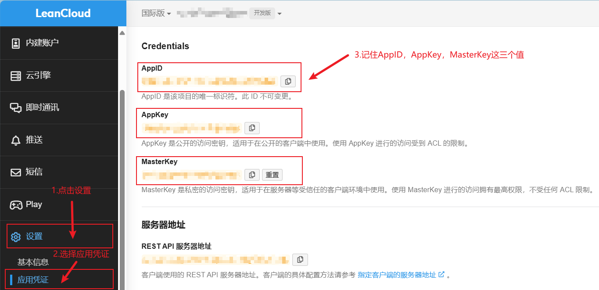
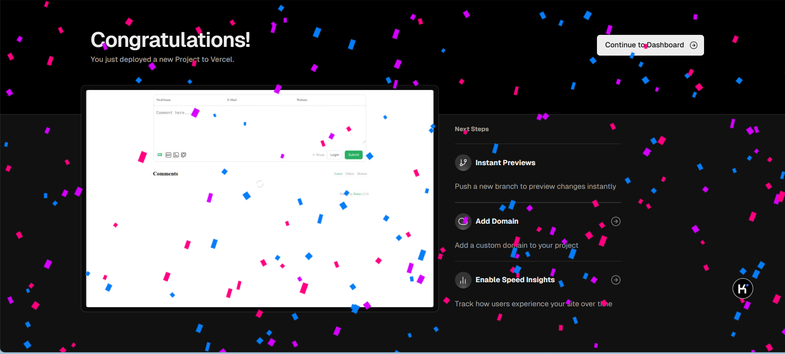

> [!note]
> 本篇文章将要介绍Waline评论及其如何部署到vuepress个人博客中。其中使用了LeanCloud作为Waline的后端服务。


## 前提

> [!tip]
> - 请确保你有使用代理的基本能力（Vercel受DNS污染，创建后的项目会无法访问）
> - 本篇文章中仅介绍使用Vercel部署Waline
> - 已经有购买好的国内域名（方便Vercel解析域名，提高国内访问性）。

## 什么是LeanCloud？

> [!Tip]
> LeanCloud 是一家提供后端云服务的公司，主要面向移动应用开发者和企业。它提供了一系列服务，包括数据存储、用户认证、消息推送、实时通信等。通过使用 LeanCloud 的服务，开发者可以快速构建应用的后端，而无需自己管理服务器和数据库。

### 主要功能

1. **数据存储**：提供类似于 NoSQL 数据库的服务，支持灵活的数据模型和实时数据同步。
2. **用户认证**：提供用户注册、登录、密码找回等功能。
3. **消息推送**：支持向用户发送通知和消息。
4. **实时通信**：支持实时聊天、文件传输等功能。
5. **应用统计**：提供应用使用情况的统计数据。
6. **云函数**：允许开发者在云端运行代码，处理逻辑和数据。

> [!important]
> 根据LeanCloud的特点，我们可以将Waline的后端服务交给LeanCloud处理。

## 什么是Waline？

> [!tip]
> Waline 是一个现代的、轻量级的评论系统，它旨在为网站提供快速、简洁的评论功能。Waline 通常以 JavaScript 库的形式存在，可以轻松地集成到任何静态网站或博客中。

### 特点

- 轻量化
- 易于集成
- 无需数据库：可以使用第三方服务存储评论数据，例如LeanCloud
- 支持社交账号登录：例如QQ、Github等
- 支持Markdown
- 实时评论更新
- 多语言支持
- 高自定义
- 提供管理端界面
- 具有一定的安全性：防止XSS攻击

## 开始部署

### 1. LeanCloud创建项目

- 注册并登录`LeanCloud`国际版
- 进入`控制台`
- 点击`创建应用`
- 按照下图填写信息：


- 创建成功后进入应用
- 点击`设置`
- 选择`应用凭证`
- 记住`Credentials`下的三个字段，分别是`AppID`、`AppKey`、`MasterKey`：



### 2. Vercel中部署Waline

- 接着[点击这里](https://vercel.com/new/clone?repository-url=https%3A%2F%2Fgithub.com%2Fwalinejs%2Fwaline%2Ftree%2Fmain%2Fexample)进入Vercel配置Waline项目
- 选择用户，用于指定克隆Waline到该用户下
- 自定义仓库名称，推荐带有Waline字段，方便记忆维护：


- 等待其自动部署，成功后如下图所示：



### 3. 在 Vercel 中配置子域名

> [!important]
> - 在进行这一步之前，请确保你有购买好的国内域名，此处以阿里云购买的域名为例
> - 在[Vercel 部署](./Vercel部署)一篇中已经详细介绍了如何绑定项目至国内域名，==此处将简练描述过程==

- 假设你购买的域名为`dadagarden.fun`

> [!tip]
> 由于在Vercel部署一篇中我们已经使用了`dadagarden.fun`并且默认重定向了该地址到`www.dadagarden.fun`。所以此处我们可以定义一个子域名`comments.dadagarden.fun`

- 在 Vercel 中进入你的Waline评论项目的控制台
- 点击`Settings`
- 选择`Domains`
- 填入子域名`comments.dadagarden.fun`
- 点击`Add`
- 第一次解析会失败，记住`Value`值，这一次的`Value`值对应的是`CNAME`类型

### 4. 在域名注册商中配置 DNS 记录

- 打开你注册 `dadagarden.fun` 域名的注册商网站并登录。
- 找到与 `dadagarden.fun` 域名相关的 DNS 管理页面。（阿里云直接搜索`域名解析`）
- 添加一条新的`CNAME`记录：
	- **名称 (Name)**：`comments`（子域名部分）
	- **类型 (Type)**：CNAME
	- **值 (Value)**：你的 Waline 项目在 Vercel 上的 `Value`
- 填写完毕后`确认`
- DNS 记录的生效时间可能需要几分钟到几小时不等。
- 打开浏览器并访问 `https://comments.dadagarden.fun`，确保它正确指向你的 Waline 项目。

### 5. 本地项目配置 Waline 评论功能

**更新 Waline 配置**：

- 在你的 vuepress-theme-hope 项目中，更新 Waline 的配置文件，确保 Waline 的服务器地址使用新的子域名 `comments.dadagarden.fun`。

> [!tip]
> 启用之前请确保安装好 @waline/client
>
>```cmd
>pnpm add -D @waline/client
>```

- 找到`theme.ts`文件，在`serverURL`中填入对应的 Waline 地址

```ts
export default hopeTheme(
	{
		comment: {
			provider: "Waline",
			serverURL: "https://comments.dadagarden.fun",
		},
	},
)
```

- 最后推送你的项目到 GitHub 仓库中
- 就可以在你的网站中看到`Waline`评论模块了。

### 6. 注册管理员

> [!important]
> 在`https://comments.dadagarden.fun`中我们还需要进行管理员注册，第一个注册的用户会成为管理员

- 进入 `评论管理` 网页，在你的Waline地址后面添加`/ui/register`进行注册
- 管理员登录后就可以对评论进行审核、删除、置顶等操作了。

> [!note]
> 到这里你的评论功能就配置完成了！

