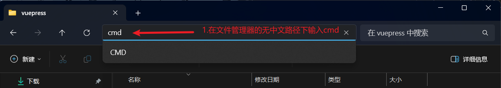

> [!important]
> 对于vuepress-theme-hope主题的快速入门，官方已经有详细的介绍和指南，本篇文章仅作个人操作参考，具有时效性，具体配置请以[官方教程](https://theme-hope.vuejs.press/zh/get-started/)为准。

## 运行环境设置

> [!tip]
> 以下工具请确保已经安装且配置好，具体安装教程此处不做介绍。

- 编辑器：VSCode
- 撰写器：Obsidian（非必须，VSCode本身就能写，使用OB可以更加专注于写作）
- 版本控制：Git
- JS运行环境：Node.js
- 包管理器：pnpm（官方推荐）

## 创建项目

1. 选择一个没有中文路径的位置存放项目：避免一些不必要的问题。

2. 创建项目模板：在文件管理器中打开对应的文件夹，在上方地址栏输入==cmd==并回车。



3. 在终端中执行以下命令：

```bash
pnpm create vuepress-theme-hope test
```

> [!warning]
> test 就是你要创建的项目文件名称


4. 配置选择：

>[!tip]
>键盘==上下键选择==，==回车键确认==。此处配置仅作个人参考，具体请以你的需求为准。

- 语言选择==简体中文==
- 包管理器选择==pnpm==
- 打包器选择==vite==
- 应用名称与描述自定义
- 版号自定义
- 设置协议直接回车
- 项目类型此处选择==blog==：
	- 本教程专注博客搭建
- 多语言选择==no==：
	- 除非有特别需求，推荐使用母语
- 初始化Git仓库选择==Y==：
	- 方便后续部署
- 部署到Github Pages工作流选择==Y==：
	- 提前部署到Github Pages，后续转移

>[!important]
>当前Gitee Pages已经停止服务，推荐使用Github Pages部署，当然你也可以选择其他的部署方式，官方有详细教程。后续部署流程我也会相应更新。


5. 启动项目示例查看一下：


- 是否启动Demo选择Y
- 按住Ctrl鼠标单击第一个Local地址即可查看


- 启动成功后效果如图：


> [!important]
> 自此，一个基本的demo创建完毕！

