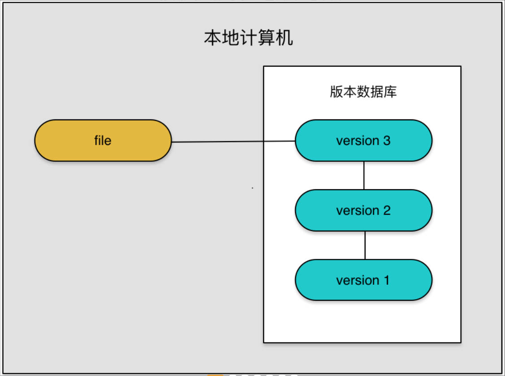
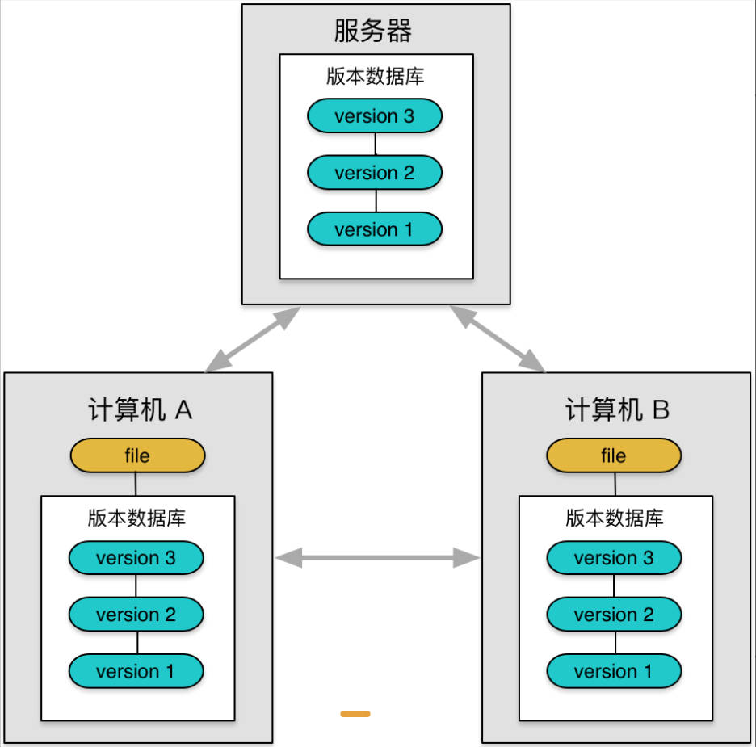

> [!tip]
> 本篇文章学习自B站狂神说Git.
> 在了解git之前我们要先了解版本控制

## 版本控制

> [!important]
> 什么是版本控制？

版本控制是一种管理代码或文件变更的系统，用于跟踪文件和文档的修改、恢复以及管理分支和合并等操作。它可以追踪文件的修改、创建和删除，并记录每一次变更的详细信息，包括谁做出了修改、何时做出的修改以及具体修改了什么内容。

==版本控制系统的主要目标是提供一个可靠的记录文件改变历史的机制==，使得团队成员可以在共享文件的情况下进行协作开发，并能方便地回滚到任意历史版本。版本控制还可以帮助==解决多人协作时可能出现的冲突问题==，通过合并不同人修改的版本，保证所有人的工作得以整合。

常见的版本控制系统有集中式版本控制系统（如CVS、Subversion等）和分布式版本控制系统（如Git、Mercurial等）。集中式版本控制系统将所有文件的历史记录存储在一个中央服务器上，而==分布式版本控制系统则允许每个开发者在本地独立地修改和提交版本，并可以方便地与其他开发者进行同步==。

> [!tip]
> 简单来说就是多人协作开发项目的技术。

### 常见的版本控制工具

- Git
- SVN（Subversion）
- CVS （Concurrent Versions System）
- VSS （Micorosoft Visual SourceSafe）
- TFS （Team Foundation Server）
- Visual Studio Online

### 版本控制分类

#### 1. 本地版本控制

记录文件每次的更新，可以对每个版本做一个快照，或是记录补丁文件，适合个人用，如RCS。



##### 👍优点：

1. 速度快：由于版本历史和变更记录保存在本地，读写操作都在本地执行，因此操作速度通常比较快。

2. 简单易用：相比于集中式或分布式系统，本地版本控制通常具有更简单的配置和使用方式，适合刚开始使用版本控制系统的开发者。

3. 安全性：本地版本控制系统通常具有更好的安全性，因为版本历史和变更记录不需要通过网络传输或存储在外部服务器上，避免了潜在的数据泄露风险。

##### 👎缺点：

1. 缺乏多人协作功能：本地版本控制系统无法用于多人同步和协作开发，每个开发者的本地版本库是相互独立的，不支持分支和合并操作。

2. 备份和恢复困难：由于版本历史和变更记录只保存在本地，一旦本地计算机出现故障或数据丢失，可能很难恢复文件的历史版本。

3. 更新和分发困难：如果多个开发者通过复制和粘贴方式进行文件的更新和分发，可能导致文件的不一致和冲突。
#### 2. 集中版本控制

所有的版本数据保存在服务器上，协同开发者从服务器上同步更新或上传自己的修改。

> SVN可以学一学


##### 👍优点：

1. 多人协作：集中式版本控制系统支持多个开发者同时使用，并可有效地协调和管理他们的工作。开发者可以从中央服务器获取最新版本的文件并将自己的更改提交到服务器上，从而实现多人协作。

2. 管理和控制：由于所有文件的版本历史和变更记录都存储在中央服务器上，集中式版本控制系统可以提供更好的管理和控制。例如，可以查看和比较不同版本之间的差异，回滚到以前的版本等。

3. 访问控制：集中式版本控制系统通常提供访问控制机制，允许管理员设置不同用户或团队对文件的读写权限，提高了安全性和权限管理。

##### 👎缺点：

1. 单点故障：由于所有文件的版本历史和变更记录保存在中央服务器上，如果该服务器出现故障或无法访问，可能会导致开发者无法提交或获取最新版本的文件。

2. 依赖网络：使用集中式版本控制系统需要连接到中央服务器，如果网络连接不稳定或中断，开发者可能无法进行文件的提交或获取。

3. 性能瓶颈：由于所有开发者都需要与中央服务器进行通信，当项目规模变得非常大或有大量开发者同时操作时，可能会出现性能瓶颈和网络延迟的问题。
#### 3. 分布式版本控制

所有版本信息仓库全部同步到本地的每个用户，这样就可以在本地查看所有版本历史，可以离线在本地提交，只需在连网时push到相应的服务器或其他用户那里。由于每个用户那里保存的都是所有的版本数据，只要有一个用户的设备没有问题就可以恢复所有的数据，但这增加了本地存储空间的占用。

>有些公司考虑使用SVN而不是git的很大一个原因是代码泄露！


##### 👍优点：

1. 分布协作：分布式版本控制系统支持分布式开发和协作。每个开发者都可以在本地工作，无需依赖中央服务器或网络连接，从而提高了灵活性和效率。

2. 强大的分支和合并：分布式版本控制系统具有优秀的分支和合并能力，可以轻松地创建、管理和合并分支。这使得团队可以并行开发不同的功能或修补不同的 bug，而不会影响彼此的工作。

3. 离线工作：每个开发者都有完整的文件副本，可以在没有网络连接的情况下继续工作。开发者可以修改文件、提交版本，等到网络恢复后再与其他开发者同步。

4. 数据备份和恢复：由于每个开发者都有完整的文件版本历史和变更记录，意外数据丢失的风险较低。一旦本地计算机出现故障，可以使用其他开发者的副本或远程存储库来恢复数据。

##### 👎缺点：

1. 复杂性：相对于集中式版本控制系统，分布式版本控制系统可能更复杂，需要更多的学习和配置。有些开发者可能需要时间适应分布式工作流程和概念。

2. 存储空间：由于每个开发者都具有完整的文件版本历史和变更记录的副本，在大型项目和多个开发者团队中，需要更多的存储空间来存储副本和版本信息。

3. 同步和冲突处理：在分布式团队中，开发者需要在合并分支时进行显式同步操作，以确保在合并冲突时进行适当的解决和冲突处理。

<hr>

> [!important]
> Git与SVN最主要区别？

SVN是集中式版本控制系统，版本库是集中放在中央服务器的，而工作的时候，用的都是自己的电脑，所以首先要从中央服务器得到最新的版本，然后工作，完成工作后，需要拍自己做完的活推送到中央服务器，集中式版本控制系统是必须联网才能工作，对网终带宽要求较高。

Git是分布式版本控制系统，没有中央服务器，每个人的电脑就是一个完整的版本库，工作的时候不需要联网了，因为版本都在自己电脑上。协同的方法是这样的：比如说自己在电脑上改了文件A，其他人也在电脑上改了文件A,这时，你们两之间只需把各自的修改推送给对方，就可以互相看到对方的修改了。
==Git是目前世界上最先进的分布式版本控制系统==。


<hr>

## 聊一聊Git历史

同生活中的许多伟大事物一样，Git诞生于一个极富纷争大举创新的年代。

Linux内核开源项目有着为数众广的参与者。绝大多数的Linux内核维护工作都花在了提交补丁和保存归档的繁琐事务上(1991- 2002年间)。到2002年，整个项目组开始启用一个专有的分布式版本控制系统BitKeeper来管理和维护代码。

到了2005年，开发BitKeeper的商业公司同Linux内核开源社区的合作关系结束，他们收回了Linux内核社区免费使用 BitKeeper的权力。这就迫使Linux开源社区（特别是Linux的缔造者Linus Torvalds)基于使用BitKeeper时的经验教训，开发出自己的版本系统。也就是后来的Git!

Git是目前世界上最先进的分布式版本控制系统。

Git是免费、开源的，最初Git是为辅助Linux内核开发的，来替代BitKeeper!


<hr>

## Git环境配置

### 软件下载

打开[Git](https://git-scm.com/book/zh/v2/%E8%B5%B7%E6%AD%A5-%E5%AE%89%E8%A3%85-Git)官网，下载Git对应的操作系统版本。

> [!tip]
> 下载缓慢可以找镜像，安装步骤本文章省略。
> 环境变量只是为了全局使用而已，Git安装时会自动配置

### 启动Git

安装成功后在开始菜单中会有Git项，菜单下有3个程序：任意文件夹下右键也可以看到对应的程序！

- Git Bash：Unix与Linux风格的命令行，使用最多，推荐最多
- Git CMD：Windows风格的命令行
- Git GUI：图形界面的Git,不建议初学者使用，尽量先熟悉常用命令

### 基本的Linux命令

- `cd 目录`：改变目录。通过cd..可以回退到上一个目录。
- `pwd`：显示当前所在的目录路径。
- `ls` 或 `ll`：列出当前目录中的所有文件和目录。ll 在显示内容时更为详细。
- `touch 文件`：创建一个新的文件。例如：touch index.js 在当前目录下创建一个名为 index.js 的文件。
- `rm 文件`：删除一个文件。例如：rm index.js 删除名为 index.js 的文件。
- `mkdir 目录`：创建一个新的目录，即新建一个文件夹。
- `rm -r 目录`：删除一个目录（文件夹）。例如：rm -r src 删除名为 src 的目录。
- `mv 源文件/目录 目标文件/目录`：移动文件或目录。也可用于重命名文件。
- `reset`：重新初始化终端/清屏。
- `clear`：清屏。
- `history`：查看命令历史。
- `help`：获取帮助。
- `exit`：退出终端。

> [!caution]
> 切勿在Linux中尝试 `rm -rf /` 这表示递归删除根目录，会将电脑中一切文件删除！

### Git 基本配置操作

> [!tip]
> Git所有的配置文件，都保存在本地！

Git相关的配置文件：
1. Git\\etc\\gitconfig：Git安装目录下的gitconfig  --system系统级
2. C:\\sers\\Administrator\\gitconfig只适用于当前登录用户的配置 --global全局

- `git config -l` ：查看配置命令。
- ==`git config --global user.name [name]`：用于设置全局的用户名。==
- ==`git config --global user.email [email]`：用于设置全局的用户邮箱。==
- `git config --global core.editor [editor]`：用于设置默认的文本编辑器。
- `git config --list`：用于列出当前仓库的所有配置项。
- `git config [config_name]`：用于查询指定配置项的值。
- `git config --global alias.[alias_name] '[command]'`：用于创建全局的命令别名。
- `git config --local ....`：用于在当前仓库范围内进行配置。
- `git remote add [remote_name] [remote_url]`：用于添加一个远程仓库。
- `git remote -v`：用于查看当前仓库的所有远程仓库。
- `git branch --set-upstream-to=[remote_name]/[branch_name]`：用于设置当前分支与远程分支的跟踪关系。
- `git push --set-upstream origin [branch_name]`：用于推送当前分支到远程仓库并设置跟踪关系。
- `git checkout -- [file]`：用于撤销对文件的修改。

>[!important]
>设置用户名和邮箱（用户标识，必须）


## Git基本理论(核心)

### 工作区域

Git本地有三个工作区域：==工作区间(Working Directory)==、==缓存区(Stage/Index)==、==资源库(Repository或Git Directory)==。如果在加上远程的==git仓库(Remote Directory)==就可以分为四个工作区域。文件在这四个区域之间的转换关系如下：


- Workspace：工作区，就是你平时存放项目代码的地方
- Index/Stage：暂存区，用于临时存放你的改动，事实上它只是一个文件，保存即将提交到文件列表信息
- Repository：仓库区（或本地仓库），就是安全存放数据的位置，这里面有你提交到所有版本的数据。其中HEAD指向最新放入仓库的版本
- Remote：远程仓库，托管代码的服务器，可以简单的认为是你项目组中的一台电脑用于远程数据交换本地的三个区域确切的说应该是git仓库中HEAD指向的版本

> [!tip]
> 工作区下面一般会有一个.git文件夹，默认是隐藏的，可以直接在资源管理器中，勾选隐藏的项目看到。

- Directory：使用Git管理的一个目录，也就是一个仓库，包含我们的工作空间和Git的管理空间。
- WorkSpace：需要通过Git进行版本控制的目录和文件，这些目录和文件组成了工作空间。
- .git：存放Gt管理信息的目录，初始化仓库的时候自动创建。
- Index/Stage：暂存区，或者叫待提交更新区，在提交进入repo之前，我们可以把所有的更新放在暂存区。
- Local Repo：本地仓库，一个存放在本地的版本库；HEAD会只是当前的开发分支(branch)。
- Stash：隐藏，是一个工作状态保存栈，用于保存/恢复WorkSpace中的l临时状态

### 基本流程

git的工作流程一般是这样的：
1. 在工作目录中添加、修改文件；
2. 将需要进行版本管理的文件放入暂存区域；
3. 将暂存区域的文件提交到git仓库。

> 因此，git管理的文件有三种状态：已修改(modified)，已暂存(staged)，已提交(committed)


## Git项目搭建

### 创建工作目录与常用指令

工作目录（WorkSpace)一般就是你希望Git帮助你管理的文件夹，可以是你项目的目录，也可以是一个空目录，建议不要有中文。
日常使用只要记住下图6个命令：


#### 1. 本地仓库搭建

>[!tip]
>创建本地仓库的方法有两种：一种是创建全新的仓库，另一种是克隆远程仓库。

1. 创建全新的仓库，需要用Git管理的项目的根目录执行：

```Git
# 在当前目录新建一个Git代码库
$ git init
```

2. 执行后可以看到，仅仅在项目目录多出了一个.git目录，关于版本等的所有信息都在这个目录里面。

#### 2. 克隆远程仓库

1. 另一种方式是克隆远程目录，就是将远程服务器上的仓库完全镜像一份至本地

```Git
# 克隆一个项目和它的整个代码历史（版本信息）
$ git clone [url]
```

## Git文件操作

### 文件4种状态

>[!tip]
>版本控制就是对文件的版本控制，要对文件进行修改、提交等操作，首先要知道文件当前在什么状态，不然可能会提交了现在还不想提交的文件，或者要提交的文件没提交上。

- `Untracked`：未跟踪，此文件在文件夹中，但并没有加入到git库，不参与版本控制。通过==git add==状态变为==Staged==。

- `Unmodify`：文件已经入库，未修改，即版本库中的文件快照内容与文件夹中完全一致。这种类型的文件有两种去处，如果它被修改，而变为==Modified==，如果使用==git rm==移出版本库，则成为==Untracked==文件。

- `Modified`：文件已修改，仅仅是修改，并没有进行其他的操作。这个文件也有两个去处，通过==git add==可进入暂存==staged==状态，使用==git checkout==则丢弃修改过，返回到==unmodify==状态，这个==git checkout==即从库中取出文件，覆盖当前修改。

- `Staged`：暂存状态.执行==git commit==则将修改同步到库中，这时库中的文件和本地文件又变为一致，文件为==Unmodify==状态执行==git reset HEAD filename==取消暂存，文件状态为==Modified==。

> [!tip]
> `git add .` 添加所有文件到暂存区；
> `git commit -m "信息"` 提交暂存区的内容到本地仓库。

### 查看文件状态

上面说文件有4种状态，通过如下命令可以查看到文件的状态：

```Git
# 查看指定文件状态
git status [filename]

# 查看所有文件状态
git status
```

### 忽略文件

> [!tip]
> 前端项目中 node_modules 不需要提交，会被自动忽略！

有些时候我们不想把某些文件纳入版本控制中，比如数据库文件，临时文件，设计文件等
在主目录下建立".gitignore'"文件，此文件有如下规则：

1. 忽略文件中的空行或以井号`#`开始的行将会被忽略。
2. 可以使用Linux通配符。例如: 
	- `*`代表任意多个字符
	- 问号`?`代表一个字符
	- 方括号`[ ]`代表可选字符范围
	- 大括号`{string1,string2,}`代表可选的字符串等。

3. 如果名称的==最前面==有一个感叹号`!`，表示例外规则，将不被忽略。
4. 如果名称的==最前面==是一个路径分隔符`/`，表示要忍略的文件在此目录下，而子目录中的文件不忽略。
5. 如果名称的==最后面==是一个路径分隔符`/`，表示要忽略的是此目录下该名称的子目录，而非文件（默认文件或目录都忽略）。

```Git
#为注释

#忽略所有.tXt结尾的文件,这样的话上传就不会被选中！
*txt

#但1b.txt除外
!lib.txt

#仅忽略项目根目录下的ToDo文件，不包括其它目录temp
/temp

#忽略bui1d/目录下的所有文件
build/

#会忽略doc/notes.txt但不包括doc/server/arch.txt
doc/*.txt
```

## 使用码云


> [!tip]
> GitHub有墙，国内一般用Gitee，公司中有时候会搭建自己的gitlab服务器。
> GitHub和Gitee上面的个人信息和项目可以作为自己的面试门面。

1. 注册登录码云，完善个人信息
2. 设置本机绑定SSH公钥，实现免密码登录！（免去每次push时都要输入密码）

```Git
#进入C:\Users\Administrator\.ssh目录
#生成公钥
ssh-keygen -t rsa
```


> [!tip]
> - 如果找不到目录，直接右键git push 输入ssh-keygen 一直回车即可 会自动创建.ssh目录。
> - .ssh目录下有两个文件，分别是：id_rsa 、id_rsa.pub。以pub结尾表示公共的。

3. 将公钥信息public key添加到码云账户中即可！

	- 在gitee中点击个人头像，进入主页。
	- 再点击头像下方点击个人设置，选择SSH公钥。
	- 通过编译器打开`id_rsa.pub`，复制其中的密钥，粘贴到网页右侧的公钥处。
	- 最后确定。

4. 使用码云创建一个自己的仓库！

- 头像右侧加号点击添加仓库。

> [!important]
> 关于开源许可证可以了解一下，这是对自己权益的一份维护和对自己成果的保护。gitee对每一类许可证都有详细说明。

## IDEA中集成Git

1. 新建项目，绑定git

	- 将我们的远程平台文件拷贝到IDEA创建的目录下就行。

2. 修改文件，使用IDEA操作git

3. 提交测试


## Git分支说明

> [!important]
> 分支在Git中相对较难，分支就是科幻电影里面的平行宇宙，如果两个平行宇宙互不干扰，那对现在的你也没啥影响。不过，在某个时间点，两个平行宇宙合并了，我们就需要处理一些问题了！

git分支中常用指令：

```Git
# 列出所有本地分支
git branch

# 列出所有远程分支
git branch -r

# 新建一个分支，但依然停留在当前分支
git branch [branch-name]

# 新建一个分支，并切换到该分支
git checkout -b [branch]

# 合并指定分支到当前分支
$ git merge [branch]

# 删除分支
$ git branch -d[branch-name]

# 删除远程分支
$ git push origin --delete [branch-name]
$ git branch -dr [remote/branch]
```

>[!tip]
>多个分支如果并行执行，我们代码不会冲突，也就是同时存在多个版本！
> - web-api A
> - web-admin B
> - web-app C

- 如果同一个文件在合并分支时都被修改了则会引起冲突：解决的办法是我们可以修改冲突文件后重新提交！

- master主分支应该非常稳定，用来发布新版本，一般情况下不允许在上面工作，工作一般情况下在新建的dev分支上工作，工作完后，比如要发布，或者说dev分支代码稳定后可以合并到主分支master上来。

> [!tip]
> 在GitHub上，使用main分支和master分支是常见的实践，但受BLM运动影响，一些人认为使用master分支可能存在种族主义的隐喻。 **为了避免任何可能的歧义**，GitHub决定将默认分支名称从master改为main。
