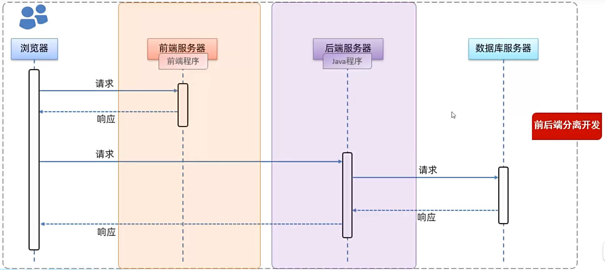
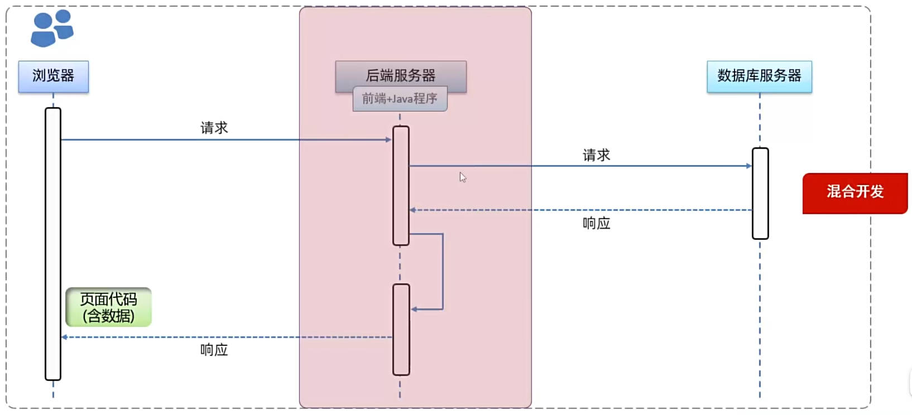

## 什么是Web？

- Web：全球广域网，也称为万维网(www World Wide Web)，能够通过浏览器访问的网站。

### 什么是Web开发？

> [!tip]
> web开发是指利用java等编程语言创建能在浏览器上访问的网站的过程。在全球互联网背景下，web开发是目前java语言最主流的企业级应用方式，众多知名电商平台（如淘宝、京东、唯品会）和企业内部管理系统都是通过web开发技术实现的。

## Web网站的工作流程

涉及到四个部分：

- **浏览器**：
  1. 用户在浏览器地址栏输入域名并点击回车。
  2. 浏览器向前端服务器发送请求。
  3. 浏览器接收前端服务器返回的前端代码。
  4. 浏览器解析前端代码生成网页结构。
  5. 浏览器根据前端代码指明的数据获取路径访问后端服务器。

- **前端服务器**：
  1. 前端服务器接收浏览器发送的请求。
  2. 前端服务器返回前端代码给浏览器。

- **后端服务器**：
  1. 浏览器访问后端服务器上的后端Java程序。
  2. 后端Java程序接收浏览器的请求。

- **数据库服务器**：
  1. 后端Java程序调用数据库服务器获取数据。
  2. 数据库服务器返回数据给后端Java程序。

### 1. 前后端分离开发

> [!tip]
> **前后端分离开发**是一种现代的软件开发模式，它将前端和后端的开发工作分开进行，使得它们可以独立开发、测试和部署。

- 前后端分离开发的特点是前端人员独立开发前端程序并部署在前端服务器上，而后端java工程师编写并部署后端程序。
### 2. 前后端混合开发

> [!tip]
> **前后端混合开发**是一种传统的开发模式，前端和后端的代码通常在同一个项目中开发和维护。

- 混合开发则是将前端程序和后端程序混合在一起进行开发和部署，服务器直接返回前端代码和数据给浏览器进行解析展示。

> [!important]
> 根据市场调研数据，当前主流和趋势是前后端分离开发，占比高达73.44%。(数据截至2023年)

## Web开发知识基础

### 前端Web开发

- HTML、CSS、JavaScript
- Vue、Element、Nginx
### 后端Web开发

- Maven
- SpringBoot
- MySQL
- SpringBoot Mybatis