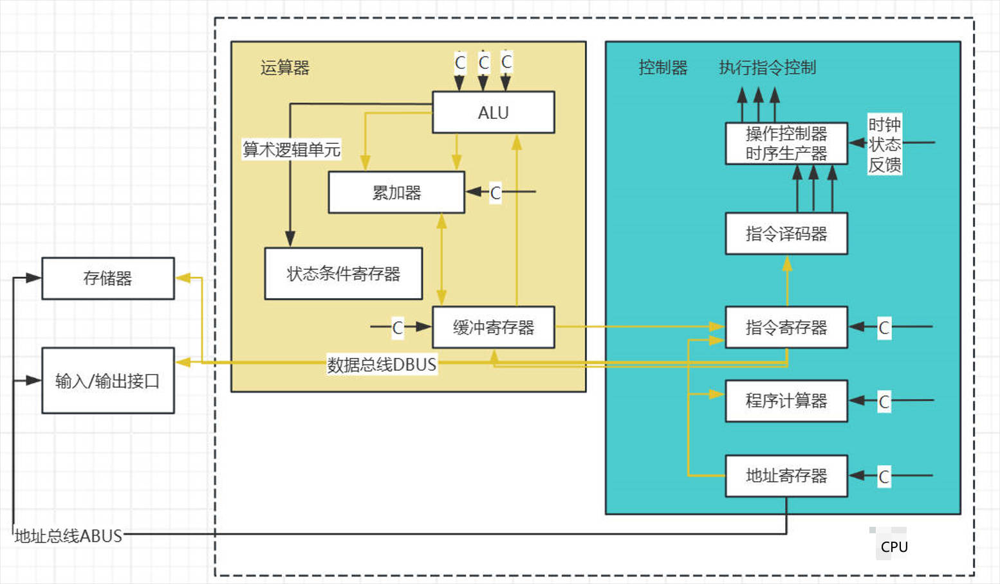

> [!tip]
> 以中级软设为介绍

## 关于软考

- 软考对于不同级别没有硬性要求，可以按需选择初中高级进行考取
- 初中高级考试伴随着等级的不断深入对于代码编写的需求反而降低，越往上考察的越是对算法和框架知识的认识。
- 考试采用机考形式、其中填空题多为客观题型，而非主观问答。考试的核心关注点多在于科目的内容差异。

### 考试目的

- 获取职称：以考代评
- 国际意义：中日韩互认
- 政府项目投标
- 申请评标专家入政府专家库
- 技能补贴&补个税【继续教育类别按照3600元定额扣除】
- 升职加薪，扩展就业方向
- 为高级科目【系分&架构】考试做准备

::: important 主要作用
以考代学，激励个人学习热情，提供目的性。
:::

### 考试流程

- 报名-支持线上/线下报名
- 缴费-支持线上/线下缴费
- 打印准考证-考前一周左右
- 参加考试-带齐资料，准时参加考试
- 查询成绩-考试结束后45-60天
- 领取证书-关注各省份具体通知

### 考试时间

一般分为上下半年：上半年5月中下旬，下半年11月中旬。2024年下半年考试时间为11月9日至12日。

部分资格证会存在一年只考一次的情况，要仔细阅读官方发送的考试指南和时间。

### 考核标准

一般情况所有科目达到45分合格

### 综合知识+案例分析

1. 综合知识客观题：75空
	- 考试时间：120分钟
	- 满分75分
2. 软件设计主观题：6道大题（只做5道）
	- 考试时间：120分钟
	- 满分75分
	- 前四道必答，后2道二选一（JAVA或C++）

#### 综合知识（上午综合题）

|   知识点    | 分数  |                                             说明                                              |   比例   |
| :------: | :-: | :-----------------------------------------------------------------------------------------: | :----: |
|  软件工程基础  | 13  |               开发方法与开发模型、数据流图与数据字典、结构化设计、测试方法与McCabe环路复杂度、软件维护、质量特征、CMM、Pert图                | 17.33% |
|   面向对象   | 11  |                                 面向对象基本概念、面向对象分析与设计、UML、设计模式                                 | 14.67% |
| 数据结构与算法  |  9  | 数组、顺序表与链表、队列与栈、字符串、二叉树的存储与特性、二叉树遍历、排序二叉树、最优二叉树、图的概念与存储、图的遍历、图的拓扑排序、二分查找、哈希查找、常见的排序算法、常见算法策略 |  12%   |
|  程序设计语言  |  6  |                    各种程序语言的特点比较、编译与解释、编译器处理过程、错误管理、传值与传址、有限自动机、正规式、后缀表达式                     | 8.00%  |
| 计算机硬件基础  |  6  |              数据的表示、CPU组成、CISC与RISC、流水线技术、层次化存储、I/O数据传输控制方式、可靠性方式、校验方法、计算机性能指标               | 8.00%  |
|   操作系统   |  6  |                      信息量与PV操作、死锁问题、段页式存储、磁盘调度、文件管理（索引文件结构、位视图与树形目录结构）                       | 8.00%  |
|  数据库系统   |  6  |                      E-R模型、关系代数和SQL查询语句、规范化理论（键、范式、模式分析）、并发控制、分布式数据库特点                      | 8.00%  |
|  计算机网络   |  5  |                              OSI模型、TCP/IP协议簇、子网划分、常用的网络命令、URL                               | 6.67%  |
|  信息安全知识  |  5  |                 加密/解密技术、数字签名与信息摘要、数字证书、网络安全协议、常见的网络威胁、常见的网络安全控制方式、网络安全防范体系                  | 6.67%  |
| 知识产权与标准化 |  3  |                                知识产权保护对象和范围、保护期限、知识产权归属、侵权判定                                 | 4.00%  |
|   专业英语   |  5  |                                           专业英语填空                                            | 6.67%  |

>[!tip]
>可以提前30分钟交卷

#### 软件设计（下午主观题）

| 题号  | 试题类型 |   学科知识点    |                           考察内容                           |
| :-: | :--: | :--------: | :------------------------------------------------------: |
| 试题1 | 必答题  |   数据流程图    | 给出相应名称（补充外部实体、补充数据存储、补充加工），补充数据流图的确实部分（补充数据流），数据流图相关解答题。 |
| 试题2 | 必答题  |   流程图设计    |               E-R模型、关系模式、主键/外键、规范化理论、增加实体等               |
| 试题3 | 必答题  |   UML建模    |                  类图、用例图、活动图、状态图等补充图示的缺失                  |
| 试题4 | 必答题  |   C语言算法    |                 分治法、贪心法、动态规划法、回溯法等算法策略应用                 |
| 试题5 | 选答题  | C++语言程序设计  |                       C++语法 + 设计模式                       |
| 试题6 | 选答题  | Java语言程序设计 |                      Java语法 + 设计模式                       |
> [!warning]
> 每道题不要超过25分钟

>[!tip]
>1. 要看得懂代码
>2. 了解各语言语法结构

### 备考策略

- 高质量的备考资料--自收集整理
- 高效的备考方式
	- 基础阶段：大面积撒网（60%）略读->做题->回顾->精度，每章小迭代，一轮迭代一般1个月至一个半月，最多不超过2个月。
	- 积累阶段：有针对性的突破（30%）完成所有章节之后，进行真题测试，测试回顾，分析弱点，再到章节走小迭代。
	- 冲刺阶段：全过程回顾（10%）对已练习的知识点进行梳理，对以前的错题进行回顾，巩固加深。

#### 刷题策略

1. 知识点练习题
2. 章节练习题
3. 真题
4. 模拟题
5. 冲刺题

#### 确定备考计划

1. 全程计划
2. 月计划
3. 周计划
4. 日计划

> [!important]
> - 构造自己的思维导图
> - ”二八定律“，将时间用在重点上
> - 各个击破，混合训练
> - 不要眼高手低，也不要畏难退缩，一定要动手练习

---
## 一、数据的表示

- 考点1：进制转换
- 考点2：码制（原码/反码/补码/移码）
- 考点3：浮点数的表示
- 考点4：逻辑运算

### 考点1：进制转换

|   进制    |         数码          | 基数  |   位权   |
| :-----: | :-----------------: | :-: | :----: |
| 十进制(D)  | 0,1,2,3,4,5,6,7,8,9 | 10  | $10^k$ |
| 二进制(B)  |         0,1         |  2  | $2^k$  |
| 十六进制(H) |   0-9,A,B,C,D,E,F   | 16  | $16^k$ |
>[!tip]
>十六进制中，字母表示：
>- A 表示 10
>- B 表示 11
>- C 表示 12
>- D 表示 13
>- E 表示 14
>- F 表示 15

#### ==按权展开法==

R进制转十进制使用按权展开法，其具体操作方式为：将R进制数的每一位数值用 $R^k$ 形式表示，即幂的底数是R，指数为k，k与该位和小数点之间的距离有关。当该位位于小数点左边，k值是该位和小数点之间数码的个数，而当该位位于小数点右边，k值是负值，其绝对值是该位和小数点之间数码的个数加1。

例如二进制：

$10100.01 = 1 \times 2^{4} + 1 \times 2^{2} + 1 \times 2^{-2}$

例如七进制：

$604.01 = 6 \times 7^{2} + 4 \times 7^{0} + 1 \times 7^{-2}$

#### ==短除法==

十进制转R进制使用短除法（除基取余法）。

例如将94转换为二进制

1. 将94除以2，得到商47和余数0。
2. 将47除以2，得到商23和余数1。
3. 将23除以2，得到商11和余数1。
4. 将11除以2，得到商5和余数1。
5. 将5除以2，得到商2和余数1。
6. 将2除以2，得到商1和余数0。
7. 最后，1除以2，得到商0和余数1。

现在，我们将这些余数从下到上读出来，即得到94的二进制表示：1011110。

若将94转换为十六进制

1. 将94除以16，得到商5和余数14。
	- 在十六进制中，数字10到15分别用字母A到F表示，所以余数14用字母"E"表示。
2. 将商5保留，因为它小于16，不需要进一步转换。

因此，十进制数94转换为十六进制数是5E。

#### ==减法==

十进制转二进制使用减法。

记忆内容：

- $2^0=1$
- $2^1=2$
- $2^2=4$
- $2^3=8$
- $2^4=16$
- $2^5=32$
- $2^6=64$
- $2^7=128$
- $2^8=256$
- $2^9=512$
- $2^{10}=1024$

以94为例：

- 小于且离94最近的乘幂为64
	- 94-64=30（2的6次方）
- 小于且离30最近的乘幂为16
	- 30-16=14（2的4次方）
- 小于且离14最近的乘幂为8
	- 14-8=6（2的3次方）
- 小于且离6最近的乘幂为4
	- 6-4=2（2的2次方）
- 小于且离2最近的乘幂为2
	- 2-2=0（2的1次方）
- 结束

将出现的位权记为1，即出现过的几次方，几的位置就为1。

| 位号  | 6   | 5   | 4   | 3   | 2   | 1   | 0   |
| --- | --- | --- | --- | --- | --- | --- | --- |
| 位值  | 1   | 0   | 1   | 1   | 1   | 1   | 0   |

最后结果为位值：1011110

#### ==进制转换==

二进制转八进制与十六进制

##### 二进制转换为八进制

1. **分组**：从二进制数的最低位开始，将二进制数每3位分为一组。如果二进制数的位数不是3的倍数，可以在最左边补0以补足3位。
2. **转换**：将每组3位二进制数转换为对应的八进制数。二进制的000到111分别对应八进制的0到7。

##### 二进制转换为十六进制

1. **分组**：从二进制数的最低位开始，将二进制数每4位分为一组。如果二进制数的位数不是4的倍数，可以在最左边补0以补足4位。
2. **转换**：将每组4位二进制数转换为对应的十六进制数。二进制的0000到1111分别对应十六进制的0到F。

##### 示例

假设我们有一个二进制数`1011011`，我们分别转换为八进制和十六进制：

- **转换为八进制**：
    
    1. 分组：001 011 011（在最左边补两个0）
    2. 转换：001（1）011（3）011（3）
    3. 结果：133

- **转换为十六进制**：
    
    1. 分组：0101 1011
    2. 转换：0101（5）, 1011（B）
    3. 结果：5B

这样，二进制数`1011011`转换为八进制是`551`，转换为十六进制是`5B`。

### 考点2：码制

#### 原码/反码/补码/移码

假设固定读取长度为8位：

|     |    数值1    |   数值-1    |    1-1    |
| :-: | :-------: | :-------: | :-------: |
| 原码  | 0000 0001 | 1000 0001 | 1000 0010 |
| 反码  | 0000 0001 | 1111 1110 | 1111 1111 |
| 补码  | 0000 0001 | 1111 1111 | 0000 0000 |
| 移码  | 1000 0001 | 0111 1111 | 1000 0000 |
- 原码：最高位是符号位，其余低位表示数值的绝对值
- 反码：正数的反码与原码相同，负数的反码是其绝对值按位取反（符号位不变）
- 补码：正数的补码与原码相同，负数的补码是其反码末位加1（符号位不变）
- 移码：补码的符号位按位取反

::: important 补充
1. 原码：
	- 原码是最直接的二进制表示，用于表示有符号的整数。
	- 原码的第一位是符号位，其中0表示正数，1表示负数。
	- 剩下的位表示数值的大小。
2. 反码：
	- 反码主要用于二进制的算术运算，特别是减法。
	- 对于正数，反码与其原码相同。
	- 对于负数，反码是其原码除符号位外的所有位取反（0变1，1变0）
3. 补码：
	- 补码同样用于二进制的算数运算，特别是加法和减法。
	- 对于正数，补码与其原码相同。
	- 对于负数，补码是其反码加1。这使得负数的加法运算可以通过正数的加法运算实现。
4. 移码：
	- 移码是一种特殊的编码方式，通常用于浮点数的指数部分。
	- 移码的目的是将偏移量（bias）加到实际的指数上，以简化浮点数的运算。
	- 移码的计算方法是将指数加到一个固定的偏移量，然后转换位二进制。
:::

::: tip 码制的应用
在计算机中，补码是最常用的二进制编码方式，因为它简化了计算机的硬件设计，使得加法和减法可以使用相同的电路来实现。例如，当你想计算一个负数的补码时，你只需要将这个负数的原码转换为反码，然后加1即可得到补码。在实际的计算机系统中，数值的存储和运算都是基于补码，这样可以避免额外的硬件逻辑来处理正负数的区分。
:::

#### 定点整数/定点小数/数码个数

| 码制  |             定点整数              |                定点小数                 |  数码个数   |
| :-: | :---------------------------: | :---------------------------------: | :-----: |
| 原码  | $-(2^{n-1}-1)$~$+(2^{n-1}-1)$ | $-(1-2^{-(n-1)})$~$+(1-2^{-(n-1)})$ | $2^n-1$ |
| 反码  | $-(2^{n-1}-1)$~$+(2^{n-1}-1)$ | $-(1-2^{-(n-1)})$~$+(1-2^{-(n-1)})$ | $2^n-1$ |
| 补码  |   $-2^{n-1}$~$+(2^{n-1}-1)$   |        -1~$+(1-2^{-(n-1)})$         |  $2^n$  |
| 移码  |   $-2^{n-1}$~$+(2^{n-1}-1)$   |        -1~$+(1-2^{-(n-1)})$         |  $2^n$  |

**定点整数**

当n=8，也就是一共8个数位时：

- 原码：$-(2^{n-1}-1)$~$+(2^{n-1}-1)$
	- -127~+127
- 转为二进制
	- 1111 1111 ~ 0111 1111

- 补码：
	- 1000 0000 ~ 0111 1111
	- 其中-128的补码为1000 0000是认为规定。

**定点小数**

当n=8，也就是一共8个数位时：

- 原码：$-(1-2^{-(n-1)})$~$+(1-2^{-(n-1)})$
	- -0.1111111 ~ +0.1111111

- 补码：
	- -1 ~ +0.1111111
	- 其中-1的补码为1000 00.00是人为规定。

::: important 定义补充
在数字系统中，数据可以以不同的格式存储，其中两种常见的格式是定点数和浮点数。

1. 定点整数：
	- 定点整数是指小数点固定在某个位置的整数。在计算机中，整数通常以定点形式存储，小数通常被假设在最右边的数字之后。
	- 例如，如果我们有一个8位的二进制数01010101，它可以表示为定点整数85（十进制）。
2. 定点小数：
	- 定点小数是指小数点固定在某个位置的小数。在计算机中，定点小数通常用于需要精确小数运算的场合，如金融运算。
	- 定点小数的表示方式是将小数点固定在数字的某个位置，然后按照这个固定的位置来存储数字。例如，如果我们有一个定点小数1.25，并且我们决定小数点后面保留两位小数，那么在二进制中，它可能表示为0.101（这里假设我们使用3为来表示整数部分，2位来表示小数部分）。

在实际的计算机系统中，定点数的表示通常涉及到位数的分配，即决定多少位用于表示整数部分，多少位用于表示小数部分。这种分配方式会影响到数值的精度和范围。

与定点数相对的是浮点数，浮点数的表示方式允许小数点的位置变动，这样可以表示更大范围的数值，但通常会牺牲一些精度。浮点数的表示遵循特定的标准，如IEEE 754标准。
:::

#### 例题

::: tip 例题1
采用n位补码（包含一个符号位）表示数据，可以==直接表示数值==（）。
- A、$2^n$
- B、$-2^n$
- C、$2^{n-1}$
- D、$-2^{n-1}$
:::

==法一：==

根据公式可知：
- 补码的定点整数范围
	- $-2^{n-1}$~$+(2^{n-1}-1)$
- 补码的定点小数范围
	- -1~$+(1-2^{-(n-1)})$

- 根据范围可知可以直接表示的数值为$-2^{n-1}$

==法二：==

假设n=4（4位补码），我们来分析每个选项：

- 选项A: $2^n$
	- 当n=4时，$2^n$=16
	- 4位补码的最大正数是  $2^{4-1}-1$ = 15
	- 因此，$2^n$（16）超出了4位补码的表示范围。

- 选项B: $-2^n$
	- 当n=4时，$-2^n=-16$
	- 4位补码的最小负数是 $-2^{4-1}=-8$
	- 因此，$-2^n$（-16）超出了4位补码的表示范围。

- 选项C: $2^{n-1}$
	- 当n=4时，$2^{n-1}=2^3=8$
	- 4位补码的最大正数是 $2^{4-1}-1$ = 15
	- 因此，$2^{n-1}$（8）在4位补码的表示范围内，但不是直接表示的数值。

- 选项D: $-2^{n-1}$
	- 当n=4时，$-2^{n-1}=-8$
	- 4位补码的最小负数是 $-2^{4-1}=-8$
	- 因此，$-2^{n-1}$（-8）是4位补码可以直接表示的最小负数。

通过代入n=4的具体值，我们可以看到：

- 选项A和B的值都超出了4位补码的表示范围。
- 选项C的值虽然在范围内，但不是直接表示的最小或最大值。
- 选项D的值是4位补码可以直接表示的最小负数。

因此，正确答案是 !!**D、$-2^{n-1}$**!!。

::: tip 例题2
如果“2X”的补码是“90H”，那么X的真值是（）。
- A、72
- B、-56
- C、56
- D、111
:::

- 先将 90H（十六进制）转换为二进制
	- 90 按权展开为十进制得到 $9\times16=144$
	- 144 转二进制使用短除法得到1001 0000
- 现在得到了补码形式的 1001 0000，所谓真值指的就是求原码形式的十进制。
	- 若是正数，原码/反码/补码都相同。
	- 若是负数，原码符号位不变，其他位按位取反得到反码，反码通过末位加1得到补码。
	- 反向推导，1001 0000 先减一得到反码：1000 1111
	- 反码 1000 1111 符号位不变，其余位按位取反得到原码：1111 0000
- 最后1111 0000 转换为十进制
	- 注意最高位（最右侧位）为符号位，1代表负号，0代表正号。
	- 所以，数值位应该位0111 0000，转为十进制为：32+16+8 = 56
	- 带上符号位得到结果：-56
- 最终结果为-56

故最终答案为**D、-56**。

### 考点3：浮点数的表示

#### ==浮点的运算==

**浮点数的表示：**

$N=尾数\times基数^{指数}$

- 尾数
	- ==定点小数==表示，小数点前保留一位数
	- 一般用==补码==表示
	- IEEE 754标准中可以用原码表示
	- 尾数可以表示数值的有效精度，长度越大，位数越多，表示精度越高
- 指数
	- 又称阶码
	- 一般为==定点整数===
	- 用==移码==表示
	- 可以用来决定数的表示范围，位数越多范围越大
- 基数
	- 在计算机当中是不需要存储的

**运算过程：**

对阶>尾数计算>结果格式化

- 对阶时，小数向大数看齐
- 对阶是通过较小数的尾数右移实现的

#### ==例题==

::: tip 例题1
浮点数能够表示的数的范围是由其（）的位数决定的。
- A、尾数
- B、阶码
- C、数符
- D、阶符
:::

正确答案：!!**B、阶码**!!

::: important 选项概念补充
- **数符**：数符是浮点数表示中的一个位，用来表示数值的正负。通常，0表示正数，1表示负数。数符并不决定数值的范围，它只影响数值的符号。
- **阶符**：在标准的浮点数表示中，如IEEE 754，并没有单独的“阶符”这个概念。阶码部分通常包含一个符号位，但这个位是通过偏移量（bias）来实现正负指数的表示，而不是直接表示为一个单独的符号位。因此，这个选项在标准的浮点数表示中是不适用的。
:::

::: tip 例题2
以下关于两个浮点数相加运算的叙述中，正确的是（）
- A、首先进行对阶，阶码大的向阶码小的对齐
- B、首先进行对阶，阶码小的向阶码大的对齐
- C、不需要对阶，直接将尾数相加
- D、不需要对阶，直接将阶码相加
:::

正确答案：!!**B**!!

此题考查运算步骤不做详细解释。

::: tip 例题3
设16位浮点数，其中阶符1位、阶码值6位、数符1位、尾数8位。若阶码用移码表示，尾数用补码表示，则该浮点数所能表示的数值范围是（）
- A、$-2^{64}$~$(1-2^{-8})2^{64}$
- B、$-2^{63}$~$(1-2^{-8})2^{63}$
- C、$-(1-2^{-8})2^{64}$~$(1-2^{-8})2^{64}$
- D、$-(1-2^{-8})2^{63}$~$(1-2^{-8})2^{63}$
:::

- 浮点数表示公式：$N=尾数\times基数^{指数}$

- 首先根据题意我们可以绘制一个16位的表格

<table>
  <tr>
    <th>阶符</th>
    <th colspan="6">阶码（6位）</th>
    <th>数符</th>
    <th colspan="8">尾数（8位）</th>
  </tr>
  <tr>
    <td> </td>
    <td> </td>
    <td> </td>
    <td> </td>
    <td> </td>
    <td> </td>
    <td> </td>
    <td> </td>
    <td> </td>
    <td> </td>
    <td> </td>
    <td> </td>
    <td> </td>
    <td> </td>
    <td></td>
    <td> </td>
  </tr>
</table>

- 阶码（定点整数）：n=7，移码表示范围？
	- $-2^{n-1}$~$+(2^{n-1}-1)$
	- $-64$~$63$
	- 由此可知指数可以取$-64$~$63$范围的值，排除A和B选项。
- 尾数（定点小数）：n=9，补码表示范围？
	- -1~$+(1-2^{-(n-1)})$
	- -1~$+(1-2^{-8})$
	- 根据B、D选项可知，只需要判断最小的范围即可，很明显，B选项的范围包括了D选项且可以取到。
- 因此最终答案为**B**

### 考点4：逻辑运算

#### ==关系运算符==

**关系运算符及其优先次序**

- 优先级相同（高）
	- `<`（小于）
	- `<=` （小于或等于）
	- `>`（大于）
	- `>=` （大于或等于）
- 优先级相同（低）
	- `==` （等于）
	- `!=` （不等于）

说明：

- 关系运算符的优先级低于算数运算符
- 关系运算符的优先级高于赋值运算符

#### ==逻辑运算==

- 逻辑变量之间的运算称为逻辑运算。二进制数1和0在逻辑上可以表达“真”和“假”。

**逻辑运算**

- 逻辑或（||、+、U、V、OR）：连接的两个逻辑值全0时才取0
- 逻辑与（&&、`*`、·、∩、∧、AND）：连接的两个逻辑值全1时才取1
- 逻辑异或（⊕、XOR）：连接的两个逻辑值相同时才取1，相同则取0
- 逻辑非（！、¬、~、NOT,-）：将原逻辑值取反即可

**真值表**

- 描述一个逻辑表达式与其变量之间的关系

|  A  |  B  | !A  | A+B | `A*B` | A⊕B |
| :-: | :-: | :-: | :-: | :---: | :-: |
|  0  |  0  |  1  |  0  |   0   |  0  |
|  0  |  1  |  1  |  1  |   0   |  1  |
|  1  |  1  |  0  |  1  |   0   |  1  |
|  1  |  1  |  0  |  1  |   1   |  0  |

**逻辑运算符**

- && （逻辑与）相当于其他语言中的AND
- || （逻辑或）相当于其他语言中的OR
- !（逻辑非）相当于其他语言中的NOT

例：

- a&&b 若a，b为真，则a&&b为真。
- a||b 若a，b之一为真，则a||b为真。
- !a 若a为真，则!a为假。

优先次序：

- !（非）-> &&（与）->||（或）
- 逻辑运算符中的“&&”和“||”低于关系运算符，“!”高于算术运算符
- 因此运算符的优先顺序：!>算数运算符>关系运算符>&&>||>赋值运算符

#### ==短路原则==

在逻辑表达式的求解中，并不是所有的逻辑运算符都要被执行。

1. a&&b&&c 只要a为真时，才需要判断b的值，只有a和b都为真时，才需要判断c的值
2. a||b||c 只要a为真，就不必判断b和c的值，只有a为假，才判断b。a和b都为假才判断c

::: tip 例如
(m=a>b)&&(n=c>d)

当a=1，b=2，c=3，d=4，m和n的原值为1时，由于“a>b”的值为0，因此m=0，而n=c>d不被执行，因此n的值不是0而仍保持原值1。
:::

#### 例题

::: tip 例题1
要判断字长为16位的整数a的低四位是否全为0，则（）。
- A、将a与0x000F进行"逻辑与"运算，然后判断运算结果是否等于0
- B、将a与0x000F进行"逻辑或"运算，然后判断运算结果是否等于F
- C、将a与0x000F进行"逻辑异或"运算，然后判断运算结果是否等于0
- D、将a与0x000F进行"逻辑与"运算，然后判断运算结果是否等于F
:::

- 0x000F的用二进制表示为：0000 0000 0000 1111
	- 若a的底四位结果都为0，进行逻辑与运算，其结果就为0。
	- 若a的底四位结果都为1，进行逻辑或运算，其结果也为1，等于F，无法判断。
	- 当a的低四位结果都为1，进行逻辑异或运算，其结果才为0，C选项错误。
	- 当a的低四位结果都为1，进行逻辑与运算，其结果才为F，D选项错误。
- 故正确答案为!!**A**!!

::: tip 例题2
对布尔表达式进行短路求值是指：无须对表达式中所有操作数或运算符进行计算就可确定表达式的值。对于表达式"a or((c<d)andb)”,（）时可进行短路计算。
- A、d为true
- B、a为true
- C、b为true
- D、c为true
:::

- OR表示逻辑或，因此，只要二者之中第一个为真时，即为真。
- 由于其中逻辑与部分位于括号中，所以后比较，判断a即可。
- a为真既可以实现短路计算。

正确答案为：!!**B**!!。

---
## 二、校验码

- 考点1：奇偶校验码
- 考点2：CRC循环冗余校验码
- 考点3：海明校验码

### 考点1：奇偶校验码

#### 校验码基础知识

::: important 校验码知识补充
校验码（Checksum）是一种用于检测数据传输或存储过程中可能出现的错误的算法。校验码可以用于多种目的，包括但不限于：
1. **数据完整性**：确保数据在传输或存储过程中没有篡改或损坏。
2. **错误检测**：在数据传输过程中，如果接收方计算的校验码与发送方提供的校验码不匹配，可以检测到错误。
3. **数据同步**：在数据同步过程中，校验码可以用来快速比较数据是否一致。
4. **数据压缩**：某些校验算法（如CRC）可以用于压缩数据，因为它们可以减少数据中冗余的部分。

以下是一些具体的生活中校验码的应用：
1. **快递包裹的条形码**：当你在网上购买商品后，商品被打包并贴上含有条形码的快递单。这个条形码就相当于一个校验码，它包含了商品的信息和目的地。当你的包裹到达时，快递员通过扫描条形码来确认包裹是否正确无误地到达了目的地。
2. **超市收银**：在超市结账时，收银员扫描商品的条形码，系统会根据条形码中包含的信息来确认商品的价格和库存。这里的条形码也是一种校验码，确保了商品信息的准确性。
3. **软件下载**：当你从互联网下载软件时，下载页面通常会提供一个校验码（如MD5或SHA-1）。你可以在下载完成后计算文件的校验码，然后与提供的校验码进行比较。如果两者相同，说明文件在下载过程中没有被篡改或损坏。
4. **银行转账**：当你通过银行转账时，银行系统会生成一个交易码，这个交易码包含了转账的详细信息，如金额、账户等。这个交易码就是一种校验码，确保了交易信息的完整性和正确性。
5. **电子邮件**：在发送电子邮件时，邮件服务器会为邮件内容生成一个校验码，当邮件到达收件人时，收件人可以通过比较校验码来确认邮件在传输过程中是否被篡改。
6. **数字签名**：在数字通信中，发送者会对消息生成一个数字签名，这个签名包含了消息内容和发送者的身份信息。接收者可以通过验证数字签名来确认消息的真实性和完整性。

::: tip 校验码如何帮助检测和纠正错误信息？
当接收到的信息与预期不符时（例如行政通知将1月1号改为星期二），便表明存在信息错误。通过比较接收到的信息与其对应的正确版本，可发现某一位置的差异，并利用校验码机制将其更正回原状态。比如，在计算机中，只需将错误位取反即可恢复原信息。
:::

- 码字：
	- 组成：码字通常是由信息位（数据位）和校验位（或冗余位）组成的。信息位直接代表要传输的数据，而校验位是为了检测和校正传输过程中可能发生的错误。

- 码距（汉明距离）：任何一种编码都由许多码字构成，任意两个码字之间最少变化的二进制位数就称为数据校验的码距。

例如：

- 用4位二进制表示16种状态， 则有16个不同的码字，此时码距为1。如0000与0001。每一个码字之间的不同的位数为1。因此码距就是1。如果换一种编码形式出现的是0000和0011，则这两个码字之间的码距是2，因为有两个位置字符不同。
#### 奇偶校验

- 奇偶校验码的编码方法是：由若干位有效信息（如一个字节），再加上一个二进制位（校验位）组成校验码。

- 奇校验：整个校验码（有效信息位和校验位）中”1“的个数为奇数。
- 偶校验：整个校验码（有效信息位和校验位）中“1”的个数位偶数。

::: tip 注意事项
校验方式都是通过添加冗余信息来进行检测和校正传输中的错误信息的。
:::

假设我们有一个非常简单的编码系统，用于传输字母A、B、C和D。我们可以用二进制码来表示这些字母：

- A: 00
- B: 01
- C: 10
- D: 11

现在，我们想要增加一些冗余信息（校验位），以便检测传输过程中的错误。我们可以使用一个简单的奇偶校验位来做到这一点：

- A: 000
- B: 011
- C: 101
- D: 110

在这个例子中，每个码字都有3位，最后一位是奇偶校验位。奇偶校验位是为了确保每个码字中1的数量是奇数还是偶数（在这个例子中，我们使用偶校验，因此1的数量为偶数）。

现在，让我们看看码距的概念如何应用：

1. **码距为2**：在这个编码方案中，任意两个有效码字之间的最小汉明距离是2。例如，A(000)和B(011)之间的汉明距离是2，因为它们在第二位和第三位上不同。
    
2. **错误检测**：如果传输过程中发生了一位错误，比如A(000)变成了001，我们可以检测到这个错误，因为001不是有效的码字，并且它与A(000)和B(011)的距离都是1，小于码距2。
    
3. **错误校正**：如果发生了一位错误，比如A(000)变成了010，我们仍然可以检测到错误，因为010也不是有效的码字。但是，由于我们的码距是2，我们无法确定是A发生了错误还是C发生了错误，因为它们与010的距离都是1。因此，我们无法校正这个错误。

总结来说，码距越大，编码方案检测能力就越强，但同时也需要更多的冗余位，这会增加传输的数据量。

::: important 奇偶校验的特点
- 奇偶校验中，只有奇数个数据位出错，才能检测出错误。如果是偶数个数据位错误，则不能检测出错误。存在局限性。
- 不能进行纠错。
:::
#### 例题

::: tip 例题1
以下关于采用一位奇校验方法的叙述中，正确的是（)。
- A、若所有奇数位出错，则可以检测出该错误但无法纠正错误
- B、若所有偶数位出错，则可以检测出该错误并加以纠正
- C、若有奇数个数据位出错，则可以检测出该错误但无法纠正错误
- D、若有偶数个数据位出错，则可以检测出该错误并加以纠正
:::

- 由于奇偶校验方式无法纠错，排除!!B、D!!
- 奇偶校验中，只有奇数个数据位出错，才能检测出错误。排除!!A!!。
- 因此正确答案为：!!**C**!!。

### 考点2：CRC循环冗余校验码

该考点出现概率较小，仅阐述其特点。

- CRC校验，可检查错误，不能纠错。检查错误没有奇数位或者偶数位的限制

#### CRC的基本原理和步骤：

1. **生成多项式**：CRC校验基于一个特定的生成多项式，这个多项式是根据标准或者特定应用的需求预先定义的。生成多项式的位数通常比校验位少1。
2. **数据预处理**：在原始数据块的末尾添加一定数量的校验位（通常是生成多项式的位数减1），这些校验位初始时设置为0。
3. **模2除法**：将数据块（包括附加的校验位）看作是一个大的二进制数，并用这个数除以生成多项式。这里的除法是模2除法，也就是说，它不进行传统的算术除法，而是使用异或（XOR）操作来进行。
4. **计算校验码**：模2除法的结果（余数）就是CRC校验码。这个校验码会被附加到原始数据的末尾，形成一个新的数据块用于传输或存储。
5. **错误检测**：接收方收到数据后，会使用相同的生成多项式对整个数据块（包括CRC校验码）进行模2除法。如果余数为0，则认为数据在传输过程中没有发生错误；如果余数不为0，则认为数据在传输过程中发生了错误。

#### 例题

::: tip 例题1
在（）校验方法中，采用模2运算来构造校验位。
- A、水平奇偶
- B、垂直奇偶
- C、海明码
- D、循环冗余
:::

正确答案：!!**D**!!

### 考点3：海明校验码

又称汉明码

海明校验码的原理是：在有效信息位中加入几个校验位形成海明码，使码距比较均匀地拉大，并把海明码的每个二进制位分配到几个奇偶校验组中。当某一位出错后，就会引起有关的几个校验位的值发生变化，这==不但可以发现错误，还能指出错误的位置，为自动纠错提供了依据==。

- 求取校验位公式：$2^r>=m+r+1$
- 还可写作：$2^r-1>=m+r$
- m是信息位个数，r是要求取的最小值。
- 例如传递16位信息，就将16带入m，得到r校验位的取值。

#### 例题

::: tip 例题1
以下关于海明码的叙述中，正确的是（)。
- A、海明码利用奇偶性进行检错和纠错
- B、海明码的码距为1
- C、海明码可以检错但不能纠错
- D、海明码中数据位的长度与校验位的长度必须相同
:::

正确答案：!!**A**!!

::: tip 例题2
海明码是一种纠错码，其方法是为需要校验的数据位增加若干校验位，使得校验位的值决定于某些被校位的数据，当被校数据出错时，可根据校验位的值的变化找到出错位，从而纠正错误。对于32位的数据，至少需要增加（）个校验位才能构成海明码。
- A、3
- B、4
- C、5
- D、6

以10位数据为例，其海明码表示$D_9D_8D_7D_6D_5D_4P_4D_3D_2D_1P_3D_0P_2P_1$中，其中 $D_i$(0≤i≤9)表示数据位，$P_j$(1≤j≤4)表示校验位，数据位$D_9$由$P_4$、$P_3$和$P_2$进行校验（从右至左$D_9$的位序为14，即等于8+4+2，因此用第8位的$P_4$、第4位的$P_3$和第2位的$P_2$校验)，数据位$D_5$由（）进行校验。
- A、$P_4P_1$
- B、$P_4P_2$
- C、$P_4P_3P_1$
- D、$P_3P_2P_1$
:::

- 带入公式，将32带入m，根据$2^r>=m+r+1$得到r，不会求带入选项。
- 第一问正确答案为：!!**D**!!。

- 已知$D_9$的位序为14，即等于8+4+2
- 所以$D_5$的为序为10，即等于8+2，要使用到校验位进行相加，8位和2位分别为$P_4$和$P_2$，注意是从右往左数。
- 第二问正确答案为：!!**B**!!。
### 校验码比较

|           |    校验码位数     |  校验码位置   |   检错   |  纠错  |              校验方式              |
| :-------: | :----------: | :------: | :----: | :--: | :----------------------------: |
|   奇偶校验    |      1       | 一般拼接在头部  | 可检奇数位错 | 不可纠错 | 奇校验：最终1的个数是奇数个；偶校验：最终1的个数是偶数个； |
| CRC循环冗余校验 | 生成多项式最高次幂决定  | 拼接在信息位尾部 |  可检错   | 不可纠错 |        模二除法求余数，拼接作为校验位         |
|   海明校验    | $2^r>=m+r+1$ | 插入在信息位中间 |  可检错   | 可纠错  |             分组奇偶校验             |

---
## 三、计算机结构

外设：

- 输入设备
- 辅助存储器：辅存/外存
- 输出设备

主机：

- 主存储器：主存/内存
- CPU：中央处理器

==存储器 = 辅助存储器+主存储器==
==CUP = 运算器 + 控制器==

::: important 计算机层次结构分析——计组课补充内容
冯诺依曼计算机工作原理：
- 存储程序：按地址顺序存放
- 程序控制：按指令地址访问

1. 程序是如何存储的？
	- 按地址顺序存放
	- 单元地址：区分存储器中不同存储单元的标志
	- 存储单元：存储二进制的部件

| 容量  | 地址线数量 |
| :-: | :---: |
| 1K  |  10   |
| 1M  |  20   |
| 1G  |  30   |

2. 顺序执行和跳跃执行怎么实现（程序为什么可以自动执行）？
	- 顺序执行依靠程序计数器进行反复取指、执行
	- 跳跃执行依靠条件判断修改程序计数器来改变执行顺序

**五级结构**

每一级包含三个问题：
1. 是什么语言？
2. 由什么执行？
3. 是什么级别？

- 软件级
	- 5级：高级语言级（编译程序）
	- 4级：汇编语言级（汇编程序）：使用助记符来表示机器指令
- 软件/硬件混合级
	- 3级：硬件系统级（操作系统）
- 硬件级
	- 2级：一般机器级（微程序）：一条机器指令对应一段微程序
	- 1级：微程序设计级（微程序直接由硬件执行）

特点：
- 不同用户处于不同层次
- 不同层次具有不同属性
- 不同层次使用不同工具
- 不同层次代码效率不同

**又有七级结构**

多出来两个结构：
- 指令集架构层：位于混合级下面
- 硬件逻辑层：位于微程序级下面

**层次的特点**

- 下层实现功能的
- 上层是调用实现的接口API的
- 抽象允许使用者不熟悉下层的运行原理即可操作计算机

**透明性概念**：
- 本来存在的事物或属性，从某个角度去看，好像不存在
- 如硬件的特性对C语言程序设计者而言就具有透明性

**系统观**：
- 当硬件结构发生变化时要想到可能对软件残剩的影响
- 不同类型的软件对硬件有不同的要求
- 编程的CPU硬件相关性，编程应查阅对应的CPU的编程手册
:::
### CPU结构

CUP = 运算器 + 控制器
#### 运算器

1. **算数逻辑单元ALU**：数据的算术运算和逻辑运算
2. **累加寄存器AC**：通用寄存器，为ALU提供一个工作区，用在暂存数据
3. **数据缓冲寄存器DR**：写内存时，暂存指令或数据
4. **状态条件寄存器PSW**：存状态标志和控制标志

==（争议：也有将状态条件寄存器归为控制器的）==

> [!tip]
> 考试中如果遇到分类问题，由于状态条件寄存器是存在争议的，我们放到最后来考虑。

#### 控制器

1. **程序计数器PC**：存储下一条要执行指令的地址（又叫程序控制器）
2. **指令寄存器IR**：存储即将执行的指令
3. **指令译码器ID**：对指令中的操作码字段进行分析解释
4. **时序部件**：提供时序控制信号

#### 例题

::: tip 例题1
计算机中提供指令地址的程序计数器PC在（）中。
- A、控制器
- B、运算器
- C、存储器
- D、I/O设备
:::

正确答案：!!**A、控制器**!!

::: tip 例题2
CPU执行算术运算或者逻辑运算时，常将源操作数和结果暂存在（）中。
- A、程序计数器（PC）
- B、累加器（AC）
- C、指令寄存器（IR）
- D、地址寄存器（AR）
:::

正确答案：!!**B、累加器（AC)**!!

---
## 四、寻址方式

### 指令的基本概念

一条指令就是机器语言的一个语句，它是一组有意义的二进制代码，指令的基本格式如下：

|  操作码字段  |  地址码字段   |
| :-----: | :------: |
| 操作码（OP） | 地址（或操作数） |

::: tip 指令内容补充
- **操作码字段（Opcode Field）**：

    - 指示CPU要执行的操作类型，比如加法、减法、移动数据、跳转等。
    - 操作码是机器指令的一部分，它告诉CPU的控制器和运算器如何处理数据。
    - 操作码的长度通常是固定的，根据不同的CPU架构，它可以是8位、16位、32位或更多。

- **地址码字段（Address Field）**：

    - 这个字段包含一个或多个地址，这些地址指向操作数所在的位置，可能是CPU的寄存器、内存地址或I/O设备。
    - 地址码可以指示源操作数的位置（从哪里读取数据）和目标操作数的位置（将结果写入哪里）。
    - 地址码的长度可以是固定的，也可以是可变的，这取决于特定的指令集架构（ISA）。
:::

### 寻址方式

- 立即寻址方式 
	- 特点：操作数直接在指令中，速度快，灵活性差
- 直接寻址方式
	- 特点：指令中存放的时操作数的地址
- 间接寻址方式
	- 特点：指令中存放了一个地址，这个地址对应的内容时操作数的地址
- 寄存器寻址方式
	- 特点：寄存器存放操作数
- 寄存器间接寻址方式
	- 特点：寄存器内存放的时操作数的地址

#### 例题

::: tip 例题1
在机器指令的地址字段中，直接指出操作数本身的寻址方式称为（）。
- A、隐含寻址
- B、寄存器寻址
- C、立即寻址
- D、直接寻址
:::

正确答案：!!**C、立即寻址**!!

---
## 五、CISC与RISC

CISC与RISC是计算机指令体系当中两个发展方向。

|  指令系统类型  |                        指令                        | 寻址方式  |            实现方式            |      其它       |
| :------: | :----------------------------------------------: | :---: | :------------------------: | :-----------: |
| CISC（复杂） |                 数量多，使用频率差别大，可变格式                 | 支持多种  |        微程序控制技术（微码）         |     研制周期长     |
| RISC（精简） | 数量小，使用频率接近，定长格式，大部分为单周期指令，操作寄存器，只有Load/Store操作内存 | 支持方式少 | 增加了通用寄存器；硬布线逻辑控制为主；适合采用流水线 | 优化编译，有效支持高级语言 |

::: tip CISC与RISC内容补充
**CISC**：
- 用途：适用于需要执行复杂操作的应用，如桌面计算机、服务器等。
- 优点：
	- 程序员可以用较少的指令完成更多的任务，提高编程效率。
	- 对于特定的任务，CISC可以提供更快的执行速度。
- 缺点：
	- 复杂的指令可能增加CPU的解码和执行时间。
	- 能耗相对较高。

**RISC**：
- 用途：适用于需要高并发处理的应用，如移动设备、嵌入式系统等。
- 优点：
	- 简单的指令可以快速执行，提高CPU的时钟频率。
	- 更好的能耗控制，适合移动设备。
- 缺点：
	- 程序员可能需要更多的指令来完成复杂的任务，降低了编码效率。
	- 对于某些特定的复杂操作，RISC可能不如CISC高效。
:::
### CISC与RISC比较，分哪些维度？

**比较维度**：
- 指令数量
- 指令使用频率
- 寻址方式
- 寄存器
- 流水线支持
- 高级语言支持

- CISC：复杂，指令数量多，频率差别大，多寻址
- RISC：精简，指令数量少，操作寄存器，单周期，少寻址，通用寄存器，流水线
#### 例题

::: tip 例题1
以下关于RISC(精简指令系统计算机)技术的叙述中，错误的是（）。
- A、指令长度固定、指令种类尽量少
- B、指令功能强大、，寻址方式复杂多样
- C、增加寄存器数目以减少访存次数
- D、用硬布线电路实现指令解码，快速完成指令译码
:::

正确答案：!!**B**!!

---
## 六、流水线技术

流水线技术是一种在处理器中提高指令吞吐率和效率的技术。它借鉴了工业生产中的流水线作业原理，将指令的执行过程分解成多个阶段，每个阶段由不同的处理器组件负责。这样，多个指令可以同时在处理器中处于不同的执行阶段，从而实现指令的并行处理。

### 流水线 - 概念

- 相关参数计算：
	- 流水线执行时间计算
	- 流水线吞吐率
	- 流水线加速比
	- 流水线效率
- 流水线是指在程序执行时多条指令重叠进行操作的一种准并行处理实现技术。各种部件同时处理是针对不同指令而言，它们可同时为多条指令的不同部分进行工作，以提高各部件的利用率和指令的平均执行速度。

### 流水线 - 计算

**执行时间计算**

一条指令的执行过程可以分解为取指、分析和执行三步，在取指时间$t_{取指}=3∆t$、分析时间$t_{分析}=2∆t$、执行时间$t_{执行}=4∆t$的情况下，若按串行方式执行，则10条指令全部执行完需要（）$∆t$；若按流水线的方式执行，流水线周期为（）$∆t$，则10条指令全部执行完需要（）$∆t$。

- 串行方式指顺序执行，全部执行完需要$(3+2+4)\times10 = 90$ $∆t$

- 流水线周期是分三步中最长的一段，所以为$4∆t$

- 全部执行完使用理论公式：$2+3+4+(10-1)\times4 = 45$

- 根据理论公式图示可以发现：
	- 流水线周期受到了取指、分析、执行中最长的一步影响。

- 根据实践公式图示可以发现：
	- 与理论公式图示比较，每个流水线周期完成1条指令是相同的，只有第一条指令执行实践发生了变化
	- 这是因为实际中步骤的执行会有提供冗余时间

> [!tip]
> 考试当中考理论公式居多，只有当理论公式找不到答案时，再考虑实践公式。

### 流水线 - 吞吐率计算

- 流水线的吞吐率（Though Put rate，TP）是指在单位时间内流水线所完成的任务数量或输出的结果数量。计算流水线吞吐率的最基本的公式如下：

$TP = \frac{指令条数}{流水线执行时间}$

- 流水线最大吞吐率（使用了理论公式）：

$TP_{max} = \lim_{n \to \infty}\frac{n}{(k+n-1)t}=\frac{1}{t}$

- 流水线最大吞吐率就是流水线周期的倒数

::: important 例题
 一条指令的执行过程可以分解为取指、分析和执行三步，取指时间$t_{取指}=3∆t$、分析时间$t_{分析}=2∆t$、执行时间$t_{执行}=4∆t$。10条指令的吞吐率？最大吞吐率？

- 理论流水线时间：$3+2+4+(10-1)*4=45$
- 吞吐率：$\frac{10}{45∆t}=\frac{2}{9∆t}$
- 最大吞吐率：$\frac{1}{4∆t}$
:::

#### 例题

::: tip 例题1
下列关于流水线方式执行指令的叙述中，不正确的是（）。
- A、流水线方式可提高单条指令的执行速度
- B、流水线方式下可同时执行多条指令
- C、流水线方式提高了各部件的利用率
- D、流水线方式提高了系统的吞吐率
:::

正确答案：!!**A**!!

- 流水线在准并行条件下可以同时执行多条指令

::: tip 例题2
将一条指令的执行过程分解为取指、分析和执行三步，按照流水方式执行，若取指时间t取指=$4△t$、分析时间t分析=$2△t$、执行时间t执行=$3△t$,则执行完100条指令，需要的时间为（）△t。
- A、200
- B、300
- C、400
- D、405
:::

- $4+2+3+(100-1)*4=405∆t$
- 正确答案：!!**D**!!

## 七、存储系统

- 考点1：层次化存储体系
- 考点2：Cache
- 考点3：主存编址计算

### 考点1：层次化存储体系

#### 层次化存储结构

从上往下——容量越来越小、速度越来越快、成本越来越高
- 外存（辅存）：硬盘、光盘、U盘等。
- 内存（主存）：分两类
	- 随机存储器（RAM）
	- 只读存储器（ROM）
	- 一般8GB左右网上
- Cache（高速缓存）：按内容存取
	- 用于解决CPU和内存之间速度不匹配的问题
	- 容量大概是M（兆）左右
- CPU：寄存器
	- 最快，但容量小，成本高
	- 一般以bit位为单位

局部性原理是层次化存储结构的支撑
- ==时间局部性：刚被访问的内容，立即又被访问——循环体==
- ==空间局部性：刚被访问的内容，临近的空间很快被访问——顺序结构==

虚拟存储器是由内存和外存的组合，内存不够时向外存借用。

外存+内存+Cache 称为三级存储体系

#### 层次化存储结构 - 分类

1. 存储器位置
内存&外存

2. 存取方式
	- 按内容存取：相联存储器（如Cache）
	- 按地址存取：
		- 随机存取存储器（如内存）
		- 顺序存取存储器（如磁带）
		- 直接存取存储器（如磁盘）

3. 工作方式
	- 随机存取存储器RAM（如内存DRAM）
	- 只读存储器ROM（如BIOS）

> [!tip]
> - DRAM：动态随机存取存储器
> - SRAM：静态随机存取存储器
> - Cache：高速缓存
> - EEPROM：电可擦可编程只读存储器

#### 例题

::: tip 例题1
CPU访问存储器时，被访问数据一般聚集在一个较小的连续存储区域中。若一个存储单元已被访问，则其邻近的存储单元有可能还要被访问，该特性被称为（）。
- A、数据局部性
- B、指令局部性
- C、空间局部性
- D、时间局部性
:::

正确答案：!!**C**!!

::: tip 例题2
虚拟存储体系由（）两级存储器构成。
- A、主存-辅存
- B、寄存器-Cache
- C、寄存器-主存
- D、Cache-主存
:::

正确答案：!!**A**!!

::: tip 例题3
在微机系统中，BIOS（基本输入输出系统）保存在（）中。
- A、主板上的ROM
- B、CPU的寄存器
- C、主板上的RAM
- D、虚拟存储器
:::

正确答案：!!**A**!!

### 考点2：Cache

#### Cache - 概念

- 在计算机的存储系统体系中，Cache是访问速度最快的层次==（若有寄存器，则寄存器最快）==。
- 使用Cache改善系统性能的依据是程序的局部性原理。
	- 时间局部性
	- 空间局部性