## 什么是虚拟机？

::: tip 参考文章
[什么是虚拟机](https://www.ibm.com/cn-zh/topics/virtual-machines)
:::

虚拟机（Virtual Machine 简称VM）是一种基于软件的技术，它允许单个物理计算机允许多个操作系统，每个操作系统都在自己的虚拟环境中允许。虚拟机通过模拟硬件来实现这一功能，使得每个操作系统都认为自己是运行在独立的物理硬件上。

::: tip 概述
 虚拟机是物理计算机的软件表现形式。在虚拟机中运行的操作系统 (OS) 称为访客操作系统。
 
 ::: important IBM官方答案
虚拟机 (VM) 是物理计算机的虚拟表现形式，是第一代云计算的计算单元。
:::
### 主要特点

- 隔离性：虚拟机之间互相独立不干扰，使用虚拟机评测风险软件或风险操作时不会对物理计算机造成影响
- 灵活性：用户可以自由创建或删除虚拟机
- 可移植性：虚拟机可以方便的从一个物理服务器迁移到另一个
- 兼容性：虚拟机可以在不同的硬件和操作系统上运行相同的镜像系统

## 为什么使用虚拟机？

1. 教育培训：进行环境演示，可以用于演示安装各类不同的环境
2. 隔离测试：测试不熟悉的软件和操作，减少对主机的影响
3. 成本效益：体验不同的操作系统，如Linux、Mac等
4. 快速部署：虚拟机可以用于部署新的服务和应用程序

## 主流的虚拟机

1. **Oracle VM VirtualBox**：由Oracle开发，是一款开源且免费的虚拟机软件，支持多种操作系统，包括但不限于Windows、Linux和macOS。它提供了3D虚拟化、快照功能以及对多种硬件组件的支持，适合个人用户和小型服务器部署 。
    
2. **VMware Workstation Player**：VMware提供的虚拟化解决方案，适用于个人和企业用户。功能强大，支持共享物理设备、快照、半虚拟化技术，并且可以管理Kubernetes集群和容器。
    
3. **Microsoft Hyper-V**：Hyper-V是微软提供的虚拟化技术，它允许在Windows系统上运行多个操作系统。Hyper-V通常用于服务器虚拟化，但也可以在Windows 10 Pro和Enterprise版本上用于个人使用 。
    
4. **Parallels Desktop**：Parallels Desktop是专为Mac用户设计的虚拟机软件，它允许在Mac上无缝运行Windows和其他操作系统，特别适合需要在Mac上运行Windows应用程序的用户 。

## VMware安装

[VMware 的虚拟化产品](https://www.ibm.com/cn-zh/cloud/vmware)目前是许多企业中 IT 基础架构的重要组成部分。

### 下载VMware Workstation Pro

::: tip 介绍
VMware Workstation Pro 是一款由 VMware, Inc. 开发的虚拟化软件，它允许用户在单一的物理机上创建和运行多个虚拟机。每个虚拟机都可以运行不同的操作系统和应用程序，就像它们在独立的物理硬件上运行一样。这款软件广泛应用于软件开发、测试、系统管理和教育等领域。
:::

[官方渠道](https://www.vmware.com/products/desktop-hypervisor/workstation-and-fusion)：下载和访问速度偏慢（不是很推荐）

- 官方下载之间请确保完成Broadcom账号注册（此处不赘述）

- 找到VMware Cloud Foundation

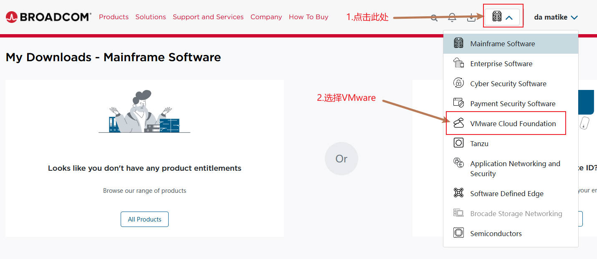

- 找到VMware Workstation Pro

- 选择Windows个人用户版（必须是个人用户，否则不给下载）

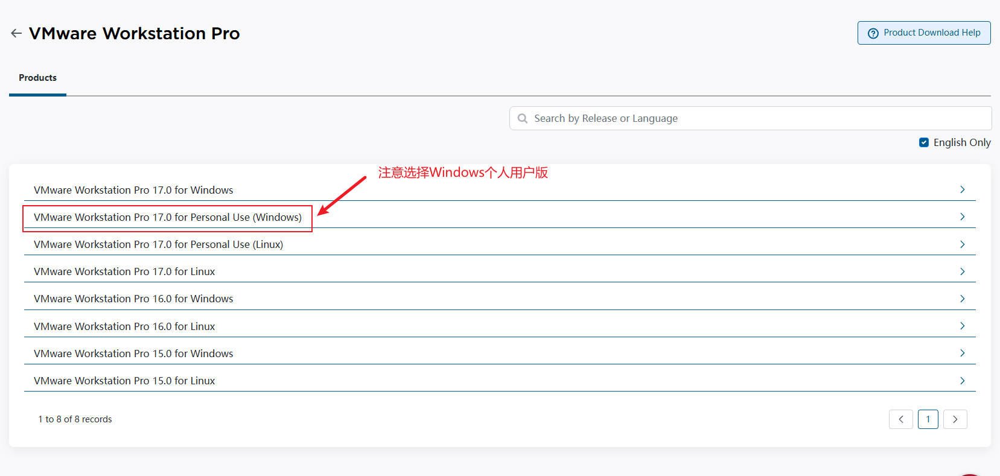

- 选择版本后进入下载页面

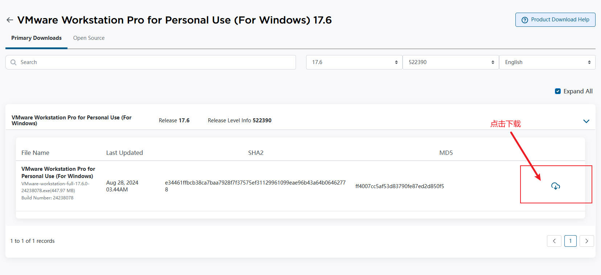

::: important 注意事项
点击下载后可能会有身份信息二次校验，填写一下地址和邮编即可，邮编可以去百度找一下对应地区的。验证完后会自动跳转回去，再次点击下载即可。
:::

### 安装

- 双击安装包文件
- 点击下一步

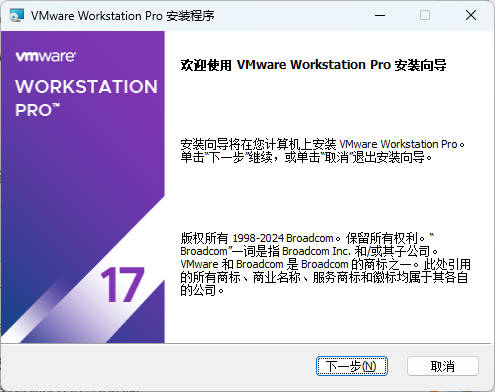

- 勾选接受
- 下一步

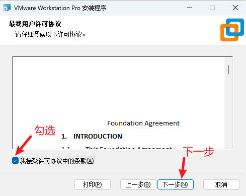

- 修改安装位置（务必无中文路径下，建议不要使用C盘）
- 勾选添加到系统环境，节省配置时间
- 下一步

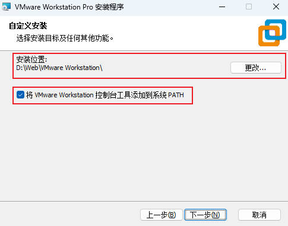

- 取消勾选检查更新和体验计划（避免杂七杂八的提醒，需要更新请手动）
- 下一步

- 自由选择是否添加快捷方式
- 下一步

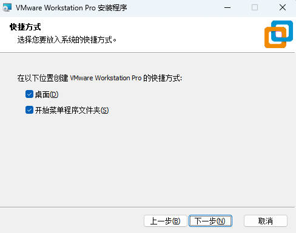

- 开始安装

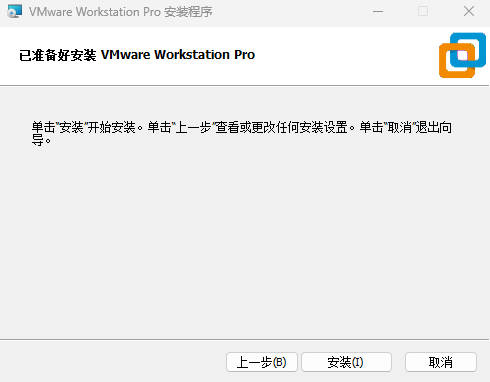

- 安装完成

### 开始使用

- 点击VMware Workstation 17
- 选择个人用途
- 点击继续

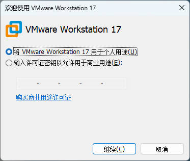

- 点击完成
- 进入界面查看

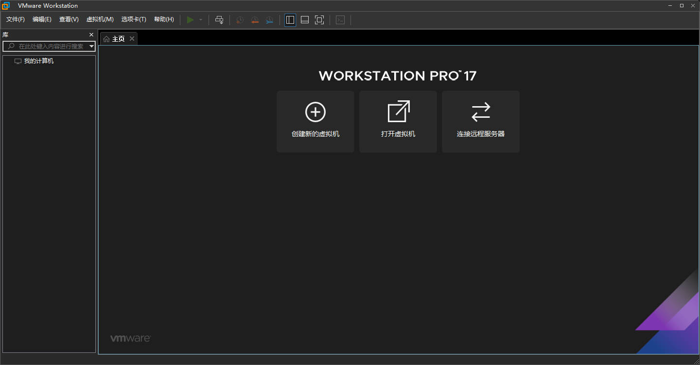

### 安装Ubuntu映像

::: tip 关于Ubuntu
Ubuntu 是一个==基于 Linux 内核的开源操作系统==，由 Canonical Ltd. 公司主导开发和维护。Ubuntu 以其易用性、强大的社区支持和安全性而闻名，它适用于各种用途，包括桌面计算、服务器、云计算和嵌入式系统。
:::

- 进入[Ubuntu官网下载](https://cn.ubuntu.com/download/desktop)
- 选择需要的版本，此处使用24.04版本
- 点击下载

::: important 意外
如果点击下载后跳转的网页为空或者404，请点击下载下方的[更多信息](https://ubuntu.com/desktop)，在其中找到需要的版本。
:::

- Ubuntu映像下载好后
- 点击创建虚拟机

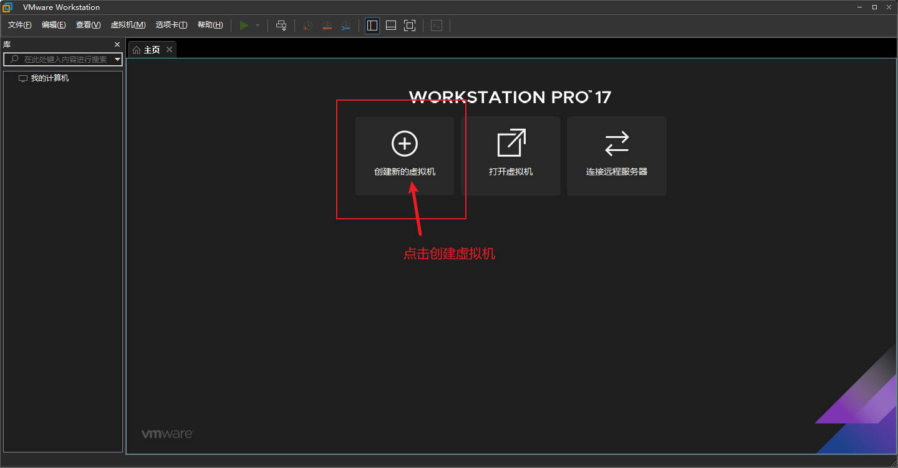

- 选择推荐
- 下一步

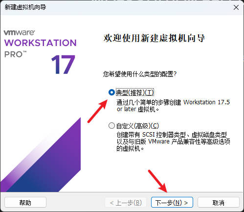

- 找到下载的光盘映像文件
- 点击下一步

- 自定义虚拟机信息
- 下一步

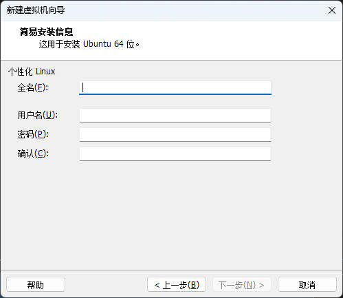

- 添加虚拟机名称
- 自定义一个位置（方便管理）
- 下一步

- 指定磁盘容量默认就好
- 下一步

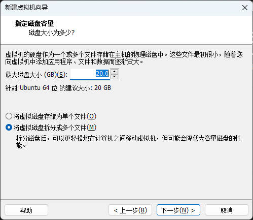

- 点击完成，等待VMware Workstation创建
- 创建完成后，虚拟机会自动打开
- 接着会出现操作指引界面
- 先选择中文，方便后续操作

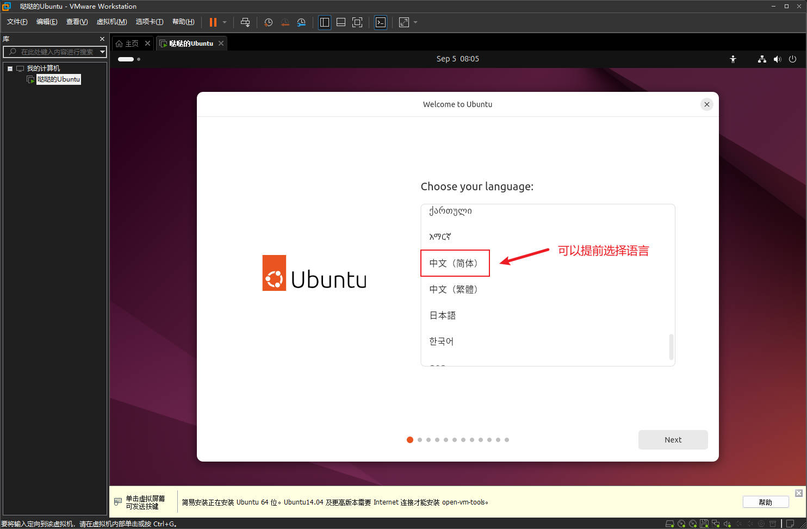

- 其余操作使用默认即可，直接下一步知道开始安装

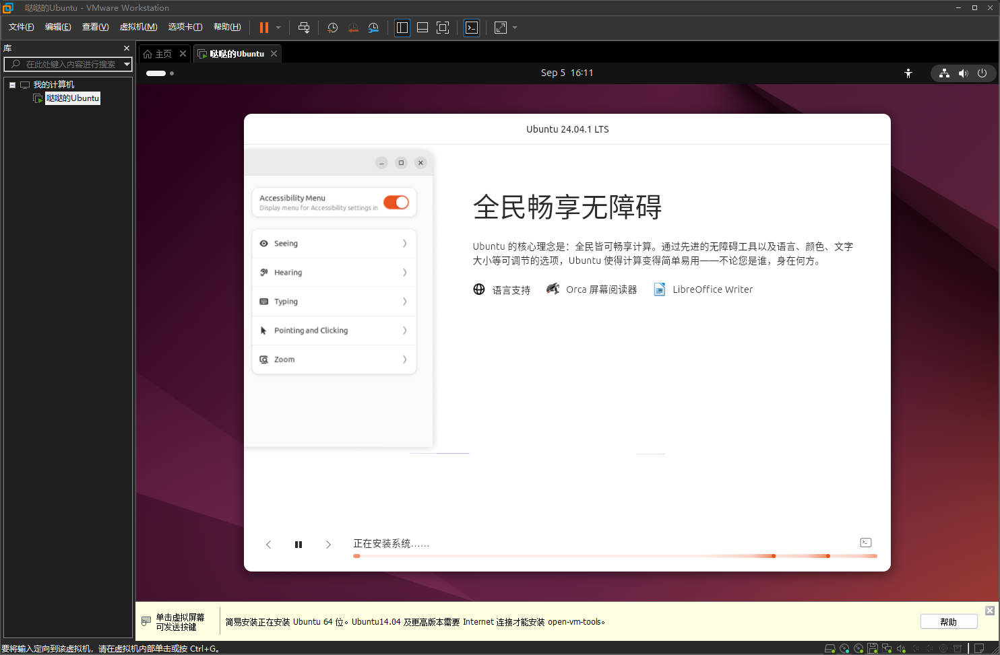

- 接着点击立即重启

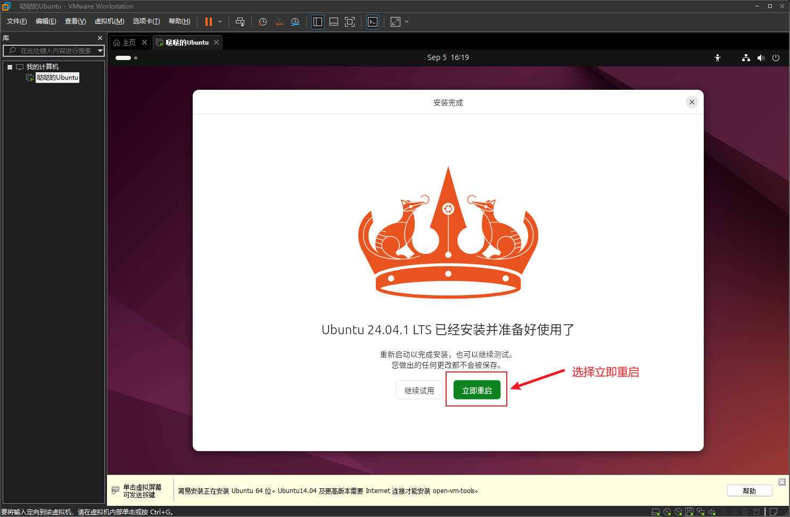

- 重启后就可以正常进入系统了

::: important 如果第一次进入黑屏咋办
- 第一次进入如果黑屏无响应，一直不动，就直接重启电脑
- 重启电脑后再次打开VMware，对刚安装的Ubuntu进行虚拟机设置
- 在显示设置中取消3D图形加速
- 接着来到文件夹中删除上一次黑屏留下的XXX.lck文件夹
- 最后重新启动Ubuntu
- 万事大吉

具体操作参考这篇文章[解决ubuntu虚拟机打开黑屏问题（简单有效，亲测）_vmware打开ubuntu黑屏-CSDN博客](https://blog.csdn.net/qq_46244851/article/details/106249640)
:::