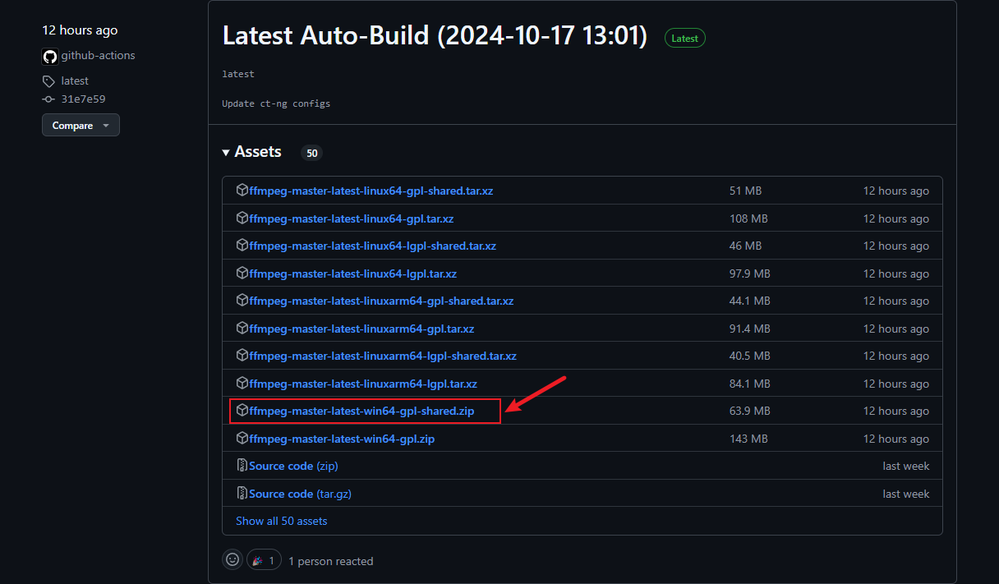
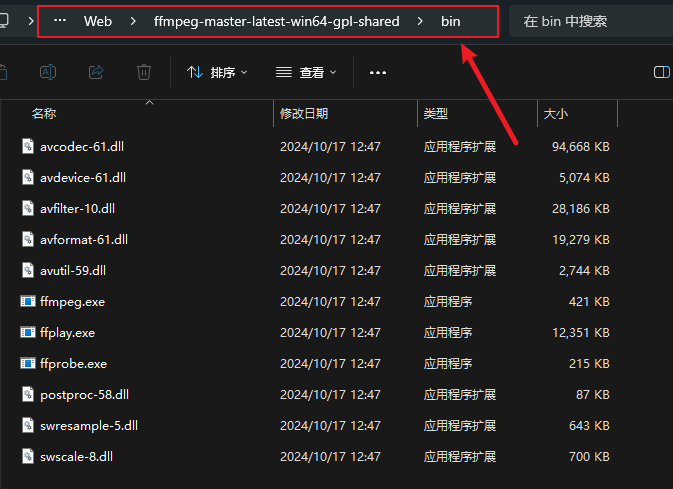
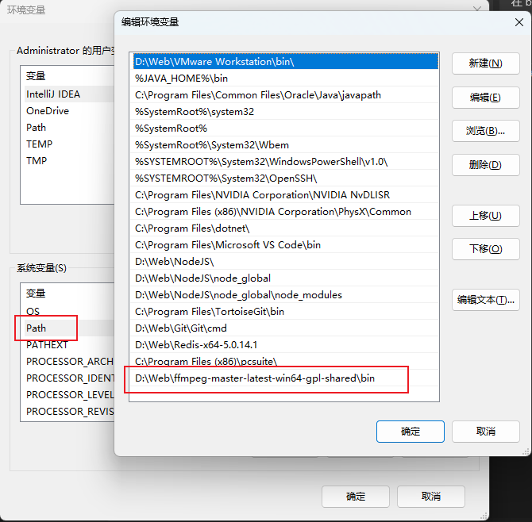
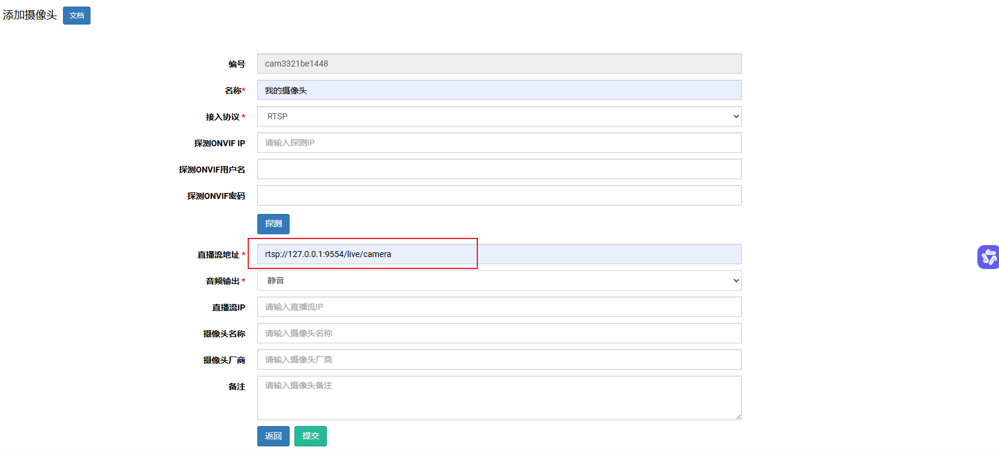
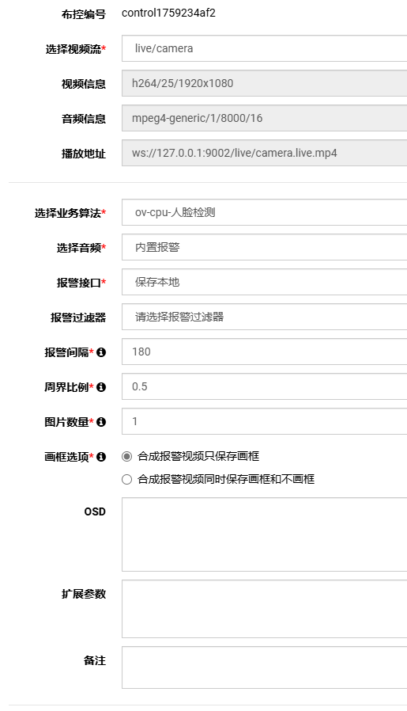
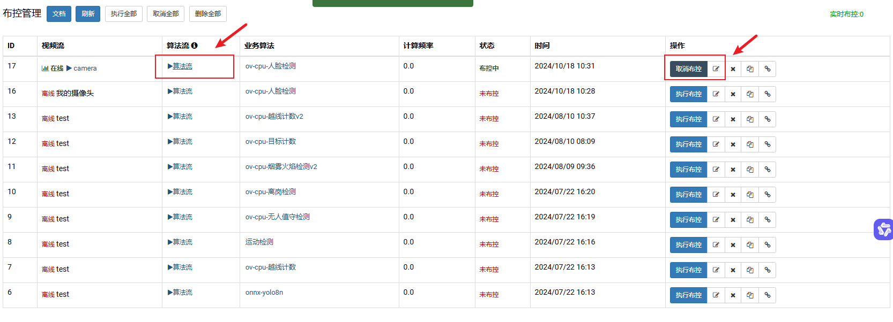

> [!tip]
> 学习来源自B站作者北小菜的仓库《视频行为分析系统v4》，系统采用C++开发，提供了多种训练模型，并且可以进行贴牌使用，当然有普通版和高级版的收费标准。
## 开源地址

[gitee地址](https://gitee.com/Vanishi/BXC_VideoAnalyzer_v4)

[github地址](https://github.com/beixiaocai/BXC_VideoAnalyzer_v4)

## 安装进入系统

此处以`xcms.4.505.x64.windows.ovtrt`版本为例

- 下载安装开源地址中提供的最新版本
- 解压到没有中文路径的文件夹
- 运行项目中的start.bat文件
- 如果cmd窗口没有出现报错，在浏览器中输入`http:\\127.0.0.1:9001`进入系统
- 默认用户名和密码为`admin`以及`admin888`


## 安装FFmpeg

> [!tip]
> 用于检测本地设备并进行视频推流

官网下载：[Download FFmpeg](https://www.ffmpeg.org/download.html#build-windows)

- 选择Windows builds by BtbN


- 选择shared版本



- 下载完成后解压，将文件夹放入到无中文的路径
- 进入bin路径中并复制地址



- 在环境变量的系统变量Path中添加该路径



- 完成确定后进入cmd，输入`ffmpeg -version`进行版本检查


## 添加摄像头

- 确定无误后运行以下命令

```cmd
（1）查看所有插在电脑上的USB摄像头列表
ffmpeg -list_devices true -f dshow -i dummy

（2）播放摄像头
ffplay -f dshow -i video="USB2.0 HD UVC WebCam"

注意："USB2.0 HD UVC WebCam" 是通过查看USB摄像头列表的命令行获得的设备名称

（3）查看摄像头的分辨率格式
ffmpeg -list_options true -f dshow -i video="USB2.0 HD UVC WebCam"

（4）将USB摄像头推流到视频行为分析系统
ffmpeg -f dshow -i video="USB2.0 HD UVC WebCam" -rtsp_transport tcp -c:v h264 -pix_fmt yuv420p -r 25 -s 1920*1080 -f rtsp rtsp://127.0.0.1:9554/live/camera

注意：
（1）rtsp://127.0.0.1:9554/live/camera 并不是固定的推流地址，可以按照自己的需求修改
```

- 在视频管理中添加摄像头
- 将刚刚定义的推流地址放进去



> [!tip]
> 此处不进行添加摄像头也可以，ffmpeg推流后系统可以自动检测到

## 添加布控

- 在布控管理中添加对应的布控和报警
- 同时左边视频区域要绘制好对应的框框



- 提交完成后来到布控管理，点击执行布控
- 再点击算法流即可看到部署后的实时识别



> [!important]
> 该系统提供了许多算法，可以直接调用。当然也可以导入外部识别和检测模型进行自定义。

