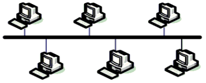
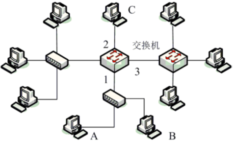

## 计算机网络的基本概念

计算机网络由一组通过通信设备和线路连接起来的独立计算机组成，其目标是为不同计算机上运行的应用程序之间提供通信服务。

- 网络中的计算机分为两类，一类运行应用程序，称为主机，这些运行在主机上的应用程序才是网络的真正“用户”。
- 另一类计算机专门负责转发数据，这类计算机中最典型的代表是以太网交换机和路由器。

### 网络分类

- 计算机网络的分类方式有多种，最常见的一种是按照网络覆盖的地域范围的大小分类，分为:

	- 广域网（Wide Area Network，WAN）

	- 城域网（Metropolitan Area Network，MAN）

	- 局域网（Local Area Network，LAN）等

- 另一种常见的网络分类方式就是按照连接计算机的通信介质分类，可分为

	- 无线网络

	- 有线网络

	- 不管是有线介质还是无线介质，均是为计算机之间的信息传递提供的通道，即信道。

### 分组概念

- 网络上传输的数据是以分组（packet）为单位的，分组实际就是一个由二进制字节构成的序列。

- 分组中最重要的部分是用户数据，用户数据就是实际要传输的数据；

- 除了用户数据，分组中还包括一些为了能正确传输分组而提供给网络使用的控制信息。

	- 控制信息一般被按固定的结构组织在一起，并添加在用户数据的前面同数据一起传输，通常被称为分组首部。

- 分组首部的组织结构再加上其后的数据部分就是所谓的分组结构（也称分组格式）。

### 网络协议

- 网络协议是指通信双方在通信时所必须遵循的规则、标准和约定。它规定了有关功能部件在通信过程中的操作，定义了数据发送和数据接收的过程。

- 一个网络协议包括三方面内容

	- “语法”，主要是指数据以及控制信息的结构或格式，即分组结构，但在网络最低层的与物理线路和信号有关的协议中，语法是指数据编码、信号电平等；

	- “语义”，是指对构成协议的各元素的含义的具体解释；

	- “同步”，也称为“时序”，它规定了通信过程中各种操作及事件的先后顺序。

### 点到点信道广播信道

- 根据计算机与信道的连接方式，可把信道分成两种，一种只能在一条信道的两端连接计算机或通信设备，即点到点信道；另一种则可以在一条信道上连接多台计算机或设备，称为广播信道。

	- 在由点到点信道组成的计算机网络中，除了联网的计算机和信道以外，还有一种被称为交换机的设备，用于在多条信道之间转发数据。

	- 一台交换机通常有很多个网络接口，每个接口可连接一条点到点信道的一端。由交换机组成的通信网络被称为交换网络。

- 在由广播信道组成的网络中，多台计算机被连接到同一条信道上，但由于信道上同时只能传送一台计算机发送的信号，因此当有两台或两台以上的计算机都要发送信息时就会出现冲突。

- 为了避免冲突，需要使用复杂的控制机制来决定网络中的哪台计算机可以向信道中发送数据，这种控制机制被称为信道的多点访问协议（Multiple Access Protocol，MAP）。

- 广播信道通常使用在覆盖范围较小的局域网中。使用广播信道的典型例子是早期的采用总线结构组网的以太网，以及现在常见的Wi-Fi无线网络。
## 典型的计算机网络——以太网

- 以太网是美国施乐（ Xerox ）公司1975年研制成功的世界上第一种局域网技术。IEEE的802委员会于1983年制定了第一个IEEE的以太网标准，其编号为802.3。

- 除了以太网技术外，20世纪80年代还相继出现了其他一些局域网技术，比较典型的包括令牌总线（Token Bus）网和令牌环（Token Ring）网等，只不过这些局域网技术在激烈的市场竞争中早已被淘汰，只有以太网技术目前仍被广泛应用。

- 信道访问协议
	- 最早出现的以太网是总线型以太网。多台计算机通过一条总线连接起来，任何两台计算机的通信都要通过这条总线进行。当总线上的两个或两个以上的节点同时发送数据时，用以表示数据的信号就会在链路上互相叠加，使接收端无法正确识别，产生数据碰撞。

	- 一旦发生碰撞，发送者必须要重新发送发生碰撞的数据，如果碰撞频繁发生，将会大大降低网络的性能。

	- 广播信道上的数据碰撞是无法完全避免的，但可以采用精确设计的多点访问控制协议减少数据碰撞发生的概率。以太网中的多点访问控制机制是带碰撞检测的载波侦听多路访问（CSMA/CD）协议。

- 为了区分网络上的不同计算机，通常是事先为每台计算机分配一个由若干二进制位组成的编号，该编号就是物理地址或MAC地址，有时也称硬件地址。

	- 以太网的MAC地址是一个48位（6字节）的无符号二进制数，书写的时候通常用16进制表示。

	- 具体地说，MAC地址是分配给计算机上的网络接口卡（简称网卡）的，固化在网卡的ROM中，48位全为1的MAC地址是广播地址，不会被分配给任何网卡。

	- 如果计算机上如果安装有多个以太网卡，则这台计算机就会有多个MAC地址，一般情况下，同一台计算机上的不同网卡会连入不同的网络。

### 以太网的MAC地址

- 为了区分网络上的不同计算机，通常是事先为每台计算机分配一个由若干二进制位组成的编号，该编号就是物理地址或MAC地址，有时也称硬件地址。

	- 以太网的MAC地址是一个48位（6字节）的无符号二进制数，书写的时候通常用16进制表示。

	- 具体地说，MAC地址是分配给计算机上的网络接口卡（简称网卡）的，固化在网卡的ROM中，48位全为1的MAC地址是广播地址，不会被分配给任何网卡。

	- 如果计算机上如果安装有多个以太网卡，则这台计算机就会有多个MAC地址，一般情况下，同一台计算机上的不同网卡会连入不同的网络。

### 以太网的帧结构

帧实际就是在物理信道上传输的数据分组的另一种叫法。帧的组成部分被称为字段，各字段的排列位置是固定的，除数据字段外，各字段长度通常也是固定不变的。

以太网帧结构如下：

| 6B   | 6B  | 2B  | 46~1500B | 4B  |
| ---- | --- | --- | -------- | --- |
| 目的地址 | 源地址 | 类型  | 数据字段     | 校验码 |
- 目的地址：指明要接收该帧的计算机的MAC地址。如果是一个广播帧，即该帧是广播给网络中的所有计算机的，目的地址应指明为广播地址。

- 源地址字段：指明发送该帧的主机的MAC地址，通过该字段，收到该帧的主机就会知道是哪台机器发送了该帧。

- 类型字段：指明接收方对帧中数据的处理方式，也就是说，接收端收到数据后，帧中的数据应该交给哪个程序处理，例如，当类型字段的值为0x0800时表示数据字段的内容为一个IP分组，应该交给操作系统的IP模块处理。

- 数据字段：也称用户数据，这部分二进制数据就是网络真正要传送的内容，至于这些二进制数据的含义和用处，跟计算机网络是无关的。其长度在46字节到1500字节之间

- 校验码：是提供给接收方用来检查数据在传输过程中是否出错的，它由发送方根据帧的其它部分的内容使用某种算法计算得到，接收方收到帧后用相同的算法对相同部分的数据再计算一遍，得到的结果如果跟校验码相同，则说明传输中数据没出错。

- 校验码的计算方法由于篇幅所限，就不再进一步解释了。

### 广播与单播

- 以太网中的计算机可以同时向其它所有的计算机发送数据，也可以选择向其中的某一台计算机发送数据，前者称为广播，后者称为单播。

- 广播是通过引入一个被称为“广播地址”的特殊地址来实现的。

	- 规定48位全为1的MAC地址为广播地址，它不能被分配给任何主机，因此它只能作为目的地址出现在帧中，而不能作为源地址使用。

	- 目的地址是广播地址的帧被称为“广播帧”。目的地址是某块网卡的MAC地址的帧则被称为“单播帧”。

- 由于以太网使用的是广播信道，因此任意一台计算机发出的帧，其它所有的计算机都能收到，但是，计算机的网卡通常只接收发给自己的帧和广播帧。

- 收到一个帧后，网卡通过帧中的目的地址来判断该帧是不是发给自己的：

	- 如果目的地址跟自己的MAC地址相同，则该帧是发给自己的，收下；

	- 如果目的地址是广播地址，说明该帧是广播帧，也要收下，其他情况则丢弃。

### 以太网的拓扑结构

- 拓扑学是几何学的一个分支；拓扑学首先把实体抽象成与其大小、形状无关的点，将连接实体的线路抽象成线，进而研究点、线、面之间的关系。网络拓扑就是指网络中的结点（通信设备或计算机）和通信线路相互之间的连接关系。

- 以太网最初的拓扑结构是使用粗同轴电缆的总线结构，后来粗同轴电缆被较为便宜的细同轴电缆所替代。

- 后来又发展出使用更为便宜的双绞线和集线器组成网星形拓扑结构的以太网络。如图所示，星型结构中各计算机通过双绞线连接到作为中心的集线器上。

### 集线器

- 集线器使用大规模集成电路来模拟同轴电缆的工作，因此这种星型以太网在逻辑上仍然是一个共享信道的“总线网络”，只不过“总线”被“缩短”并装进了盒子。

- 星型结构的以太网比使用同轴电缆的以太网络可靠性要高得多，并且价格便宜、连接简单，因此总线型以太网早已被双绞线组成的星形以太网所取代。

- 目前集线器也已逐渐被性能更好的以太网交换机所取代。

### 以太网交换机

- 交换机在样子上虽然与集线器相似，但其工作原理却大不相同。

- 以太网交换机是一种有多个以太网接口的存储转发设备，不再像集线器那样模拟总线的工作。

	- 存储转发，是指在接收数据时交换机先将收到的数据存储在自己的存储器中，待一个帧完全接收完成后，再根据其目的地址把它从相应的网络接口转发出去。

- 交换机的每个网络接口都连接到一根不同的广播链路，由于位于不同端口的链路上的计算机不再共享同一信道，因此大大减小了碰撞机会，从而提高了数据传输率。

- 交换机可以将多台计算机直接连接成一个以太网，也可以连接多个由集线器或交换机组成的以太网以形成更大的一个以太网。

### 以太网交换机的工作原理

- 首先，在交换机内部维持着一张转发表，用于记录可以到达某计算机的网络接口。该表结构如图所示。表中的三个表项分别表示MAC地址为A的主机连接在端口1上，MAC地址为B的主机连接在端口2上，MAC地址为C的主机也连接在端口1上。

| MAC地址 | 网络接口 |
| ----- | ---- |
| A     | 1    |
| B     | 2    |
| C     | 1    |

- 当交换机从某个接口收到一个帧后，分析包中的目的MAC地址，并通过查找转发表确定该数据包应转发到哪个接口；如果在表中查不到目的地址对应的端口，则向所有端口转发（除收到帧的端口外）该帧。

- 转发表是通过逆向学习算法创建并维护的。

- 交换机每收到一个帧都会把帧首部中的源地址取出，并检查转发表中是否已登记了该地址，如果未登记，则将该地址以及帧进入交换机的端口（对应网络接口）作为一个表项添加到转发表中；如果表中已经存在该地址，则用该帧入交换机的端口更新原先的网络接口。

- 逆向学习算法是基于这样一个事实：从计算机A发出的帧如果从交换机的端口x进入到交换机，那么从这个端口出发沿相反的方向一定可把一个帧传送到计算机A。

- 除以太网外，还有许多种基于不同技术的局域网，比如已经不再使用的令牌环网和令牌总线网，还有现在越来越流行的无线局域网（WIFI）等。

## 广域网与分组交换技术

- 广域网是用来实现计算机间的长距离数据通信的。

	- 网络上的计算机可能分布在相距几百公里甚至是几千公里的不同城市里。

	- 铺设长距离的通信线路成本是昂贵的，因此，最初人们在实现两台距离遥远的计算机间的通信时通常是借用已经存在的通信网络——电话网来传输计算机的数据。

- 调制解调器

	- 电话网是用于传送音频信号（是模拟信号）的，但计算机信号是数字信号，不能直接在电话网中传递的。

	- 发送端需要先将要发送的数字信号转换成模拟信号后再发送到电话线上，接收端则需要将电话线上传来的模拟信号恢复成原来的数字信号再交给目的计算机。

	- 将数字信号转换成模拟信号的设备称为调制器，将模拟信号恢复为数字信号的设备称为解调器。由于计算机间的通信通常都是即发也收，因此调制器和解调器被集成到一个设备中，叫做调制解调器（Modem），俗称“猫”。

- 使用电话网传递计算机数据有两个明显的缺点

	- 任何想通信的两台计算机在通信之前都需要先有一条电话线连接，这条连接一旦建立，其他的计算机就不能再用，即使是在没有数据传输的时候，造成资源浪费；

	- 使用电话线传输数字数据的速率（也就是带宽）太低。

- 为了克服这些缺点，人们逐渐发展起了一系列的广域网技术，先后出现的典型技术包括X.25、帧中继、ATM（异步传递方式）等。

	- 这些技术的性能指标以及设备造价相差很大，但它们最基本的原理却是相同的，都是基于分组交换技术的。

### 电路交换

- 交换的概念来源于电话网。当两部电话通话时只要用一对电话线将它们连起来就可以，但当多部电话之间需要相互通话时，每两部电话之间都连一对线显然是不可行的。

- 解决的办法是在城市中央修一个电话中心，每部电话到电话中心拉一条电话线，电话中心派一个接线员，通电话时接线员将要通话的电话接到一块；通完话再断开。

- 多个城市之间的电话要通话时，则可以建立一个更高级别的电话中心，每个城市的交换中心都连一条或多条电话线到这个更高级别中心，由该中心负责城际电话的交换。以此类推，就形成了电话网。

- 这是“交换（switch）”的本来含义，可以理解为“转接”——把一条电话线转接到另一条电话线。从通信资源的分配角度来看，“交换”就是按照某种方式动态地分配传输线路的资源。

- 1889年一种可以替代接线员的机器被发明出来，这种机器可以根据你所拨的电话号码自动将你的电话与你所拨的电话连接起来，这种机器就是“自动电话交换机”。

- 这种使用自动电话交换机通过拨号给通信双方直接建立一条物理通信线路的交换方式就是所谓的电路交换。

- 电路交换的工作过程分为三个阶段：

	- 第一阶段是建立连接，通话发起方拨号，交换机根据所拨号码选择要连接的线路，建立起一条物理线路连接；

	- 第二阶段就是利用建立的线路通话；

	- 第三个阶段称为释放连接，通话完成后通过挂断电话，通知交换机释放所占用的线路。

### 计算机广域网

- 类似于电话网，在规模较大的广域网中，也需要组建一个由通信线路和交换机构成的通信网络。

- 类似于每部电话机都有一个互不相同的电话号码一样，分组交换网络中的每台计算机也必须有一个互不相同的地址，用于区分网络中不同的计算机，同以太网的MAC地址一样，这个地址被称为计算机的硬件地址。

### 计算机网络中的数据突发性

- 计算机通信时，常常突然在短时间内有大量的数据需要传送，然后又长时间没数据传输。这种特点被称为数据传输的突发性。

- 数据的突发性使得计算机网络采用电路交换技术并不合适。

	- 如果使用电路交换，则需要在通信的两台计算机间通过拨号建立一条物理连接，连接一旦建立，其所用到的线路资源就会被该通信所独占，别人无法使用，尽管很多时间是空闲的，从而造成很大的资源浪费。

### 分组交换

- 计算机网络通常采用分组交换技术。

- 分组交换技术与电路交换技术有很大不同，在通信时通常并不需要建立连接和释放连接，也不能向电路交换那样可以连续地传送任意长的数据。

- 计算机在发送数据时，通常需要先把过长的原始数据划分成若干个较小的数据块，再在每个数据块前加上由目的地址以及其他控制信息构成的首部形成一个个数据分组，然后依次将它们发送给与计算机直接相连的交换机。

- 交换机在收到一个分组后先予以存储，再按分组首部的地址信息查找事先建好的转发表，根据表中指明的接口转发给下一台交换机，下一台交换机也进行同样的处理，一直到转发给目的计算机为止。

- 交换机的这种转发方式被称为存储转发，用这样的存储转发方式，最后分组就能到达最终目的地。

- 目的计算机在收到所有分组后，再把各分组的首部去掉，将各分组中的数据块装配成原来的数据。

### 分组交换的缺点

- 交换机收到分组后需要进行分析目的地址、查找转发表、转发等处理，这些处理需要花费时间，如果分组到达的速度快于其处理速度，后到的分组就需要在交换机内部进行排队等待，为此，交换机内部需要有较大的缓存空间用于缓存多个排队的分组。

- 另外，分组在交换机内部排队等候会造成数据传输产生较大的时延，更严重的时，如果需要排队的分组过多而导致交换机内的缓存空间用尽的话还会造成分组的丢失。

- X.25、帧中继等广域网技术都是基于分组交换的，以太网交换机其实也是一种分组交换技术。

- 不同的分组交换技术之间的差别主要在于交换机转发表的构造以及维护算法不同、分组的转发策略不同、接口连接的信号传输介质不同等，当然也有随之带来的性能、造价方面的不同。

## 网络互联

- 所谓网络的互联是指将两个或两个以上的计算机网络，通过一定的方法，用一种或多种通信处理设备相互连接起来，构成更大的网络系统，以使位于不同网络中的计算机也能相互通信和实现资源共享。

- 网络互联的形式有局域网与局域网，局域网与广域网，广域网与广域网的互联三种。

- 网络互联是计算机网络出现后随之而来的一种很自然的想法，但是，这个想法的实现却并不容易，原因是不同的网络由于采用的技术不同而差异太大，比如，硬件地址的编址方案、帧的结构、传输介质、管理与控制方式等等。

- 采用同种技术的网络互联通常要简单一些

	- 由交换机构成的两个以太网互联，通常只要分别在两个网络中各选一台交换机，再从这两台交换机上各自选择一个端口，将这两个端口用网线直接相连就可以了。这时两个以太网就连成了一个规模较大的以太网，从而实现了原来两个网络中的计算机实现互联互通的目的。

	- 从以太网交换机的工作原理可知，网中的任何一台计算机发送一个广播信息，网中所有的计算机都能收到，这时一般称这些计算机在同一个广播域中。

	- 显然，两个以太网直接相连就是将两个较小的广播域合并成了一个大的广播域，但是，当一个广播域过大时，由于网络产生的广播包过多网络性能会有很大下降甚至不能工作。

### 异种网络互联

- 较早的一种可以连接不同类型网络的设备是网桥(bridge)，网桥主要用来连接两个局域网，但网桥不是一种通用的网络到网络的连接设备。

- 两种不同种类的局域网相连，要用专门为这两种局域网相连而设计的网桥，比如一个以太网要与一个令牌环网相连，则需要用到专门设计的以太网到令牌环网的网桥，用于连接两个以太网的网桥，只能连接两个以太网，而不能用于连接其他类型的网络。

- 目前已很少使用网桥来连接两个网络，但是网桥也并非完全被淘汰了，前面所介绍的以太网交换机其实就是多端口的以太网到以太网的网桥，之所以不在叫网桥了，主要是因为网桥的端口较少，通常只有两个，而交换机则端口众多，常见的有8口、24口、48口等。

- 现在实现网络互联所使用的是一种被称为路由器（router）的设备，路由器也是一种分组交换设备，它实际上是一种具有多个网络接口的专用计算机，用来在多个网络之间转发数据分组。目前，路由器是实现网络互连的核心设备

- 仅仅靠路由器仍然是不能实现网络互联互通的，还必须在所有计算机上安装并运行一套被称为TCP/IP协议的网络通信软件才行。这套软件的核心是IP协议（Internet Protocol），即互联网协议。

- IP协议是不同网络中的计算机能够相互通信的关键，不仅仅是所有网络中的计算机，路由器上也都安装并运行着IP协议。