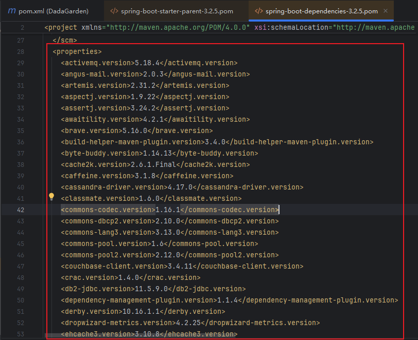
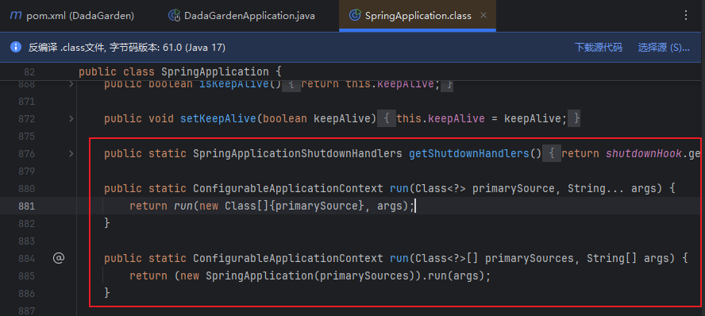

传统的Spring框架实现一个Web项目，需要手动导入各类依赖包和编写对应的XML配置文件，而Spring Boot框架则更加高效、便利和快捷。

## Spring Boot 依赖管理

### 1. spring-boot-starter-parent依赖

- spring-boot-starter-parent父依赖启动器的主要作用时进行版本统一管理。

在`pom.xml`文件中，通过Ctrl+鼠标左键进入spring-boot-starter-parent下查看源文件，找到父依赖spring-boot-dependencies，接着继续进入，就可以看到该文件通过了`<properties>`标签对一些常用的技术框架的依赖文件进行了统一的版本控制，这就是为什么`pom.xml`引入依赖项不需要标注依赖文件版本号的原因。

- 如果`pom.xml`引入的依赖文件不需要spring-boot-starter-parent管理，那么引入依赖时，必须通过`<version>`标签添加依赖版本号。

### 2. spring-boot-starter-web依赖

- spring-boot-starter-web依赖启动器的主要作用时提供Web开发场景所需要的底层所有依赖文件，它对Web开发场景所需的依赖文件进行了统一管理。

- 通过spring-boot-starter-web依赖启动器就可以实现Web场景开发，不需要引入Tomcat服务器以及Web依赖文件等。这些依赖的版本号依然由spring-boot-starter-parent父依赖进行统一管理。

::: warning 关于框架官方提供的依赖启动器与第三方
Spring Boot官方并不会对所有场景都提供依赖启动器，有些启动器是由第三方主动适配框架进行整合的，例如阿里巴巴的Druid数据源提供了druid-spring-boot-starter等，这些第三方依赖启动器的引入都需要在`pom.xml`文件中配置版本号。
:::

## Spring Boot 自动配置

Spring Boot应用的启动入口时`@SpringBootApplication`注解标注类中的`main()`方法，`@SpringBootApplication`能够扫描Spring组件并自动配置Spring Boot。

- 进入`@SpringBootApplication`底层源码

下面是 `@SpringBootApplication` 底层源码中的三个核心注解及其作用：

### 1. **`@SpringBootConfiguration`**
   - 这个注解表明当前类是一个 Spring Boot 配置类。它继承自 `@Configuration` 注解，意味着使用该注解的类可以包含 `@Bean` 方法，这些方法将被 Spring 容器管理，并可用于注入依赖项。
   - `@SpringBootConfiguration`注解的作用与`@Configuration` 注解的作用相同，只不过`@SpringBootConfiguration`注解是被Spring Boot进行重新分装命名了而已。

### 2. **`@EnableAutoConfiguration`**
   - `@EnableAutoConfiguration` 注解告诉 Spring Boot 根据添加的 jar 依赖自动配置 Spring 应用程序。Spring Boot 会尝试根据类路径上的库来猜测你想如何配置 Spring 应用程序。例如，如果你添加了 `spring-boot-starter-web` 依赖，Spring Boot 会自动配置 Tomcat 和 Spring MVC。
   - 该注解是表示开启自动配置功能，是实现自动化配置的注解。
   - 该注解是一个组合注解，通过该注解的底层，我们要知道，在定义项目包结构时，一定要规范，项目主程序启动类要定义在最外层的根目录位置，然后在根目录位置内部建立子包和类进行业务开发，这样才能保证定义的类能够被组件扫描器扫描。

### 3. **`@ComponentScan`**
   - `@ComponentScan` 注解指示 Spring 在指定的包及其子包中搜索带有 `@Component`、`@Service`、`@Repository`、`@Controller` 等注解的类。这使得 Spring 能够自动检测并注册这些组件为 Spring 应用上下文中的 bean。
   - 该注解是一个组件包扫描器，用于将指定包中的注解类自动装配到Spring的Bean容器中。

这三个注解共同工作，提供了一个快速启动的 Spring 应用程序，其中 `@SpringBootConfiguration` 定义了配置类，`@EnableAutoConfiguration` 启用了自动配置，而 `@ComponentScan` 允许 Spring 扫描并注册组件。

## Spring Boot执行流程

每个Spring Boot项目都有一个主程序启动类，在主程序启动类中有一个启动项目的`main()`方法，在该方法中，通过执行`SpringApplication.run()`即可启动整个Spring Boot程序。

查看run()方法底层源码：

`SpringApplication.run()` 方法内部执行了两个主要操作：

1. **创建 Spring 应用上下文（ApplicationContext）**
   - `SpringApplication.run()` 方法首先会创建一个新的 `ApplicationContext` 实例。这个上下文是 Spring 框架的核心，用于管理所有的 Spring 组件（即 beans）。Spring 应用上下文可以是多种类型，例如 `AnnotationConfigApplicationContext`、`ClassPathXmlApplicationContext` 或 `FileSystemXmlApplicationContext` 等，具体取决于应用程序的配置方式。

2. **运行 Spring 应用上下文并调用所有初始化回调**
   - 一旦创建了应用上下文，`SpringApplication.run()` 方法会调用 `ApplicationContext` 的 `run()` 方法。这个方法会触发 Spring 应用上下文的初始化过程，包括：
     - 调用所有实现了 `ApplicationContextInitializer` 接口的初始化器。
     - 调用所有实现了 `ApplicationListener` 接口的监听器。
     - 触发所有的 `@PostConstruct` 注解方法，这些方法在依赖注入完成后执行。
     - 触发所有的 `@EventListener` 注解方法，这些方法用于监听应用程序事件。
     - 触发 `ApplicationReadyEvent`，这表示应用程序已经准备好接收请求。

此外，`SpringApplication.run()` 还负责处理命令行参数和配置文件，以及应用任何特定的配置类或自动配置。它还提供了一种机制来注册和使用自定义的事件监听器和初始化器。

